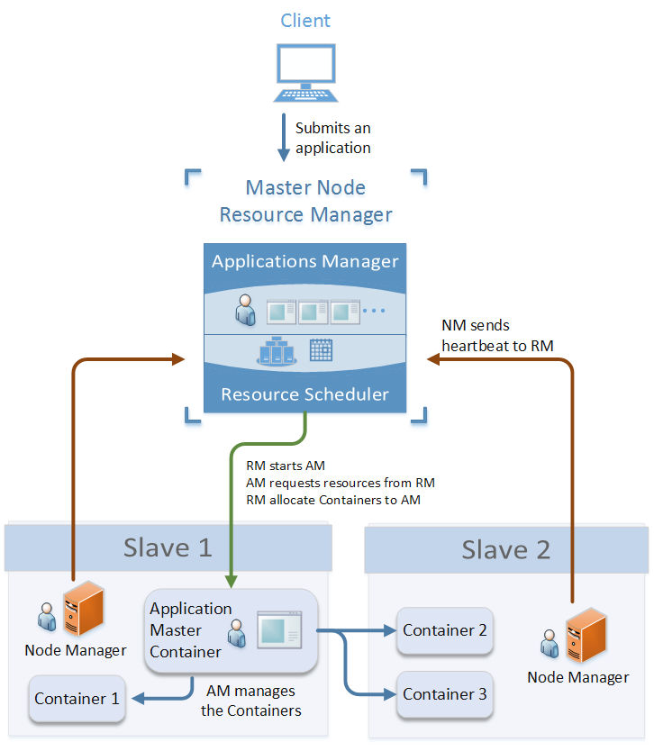

# Yarn

#### ResourceManager

每个Hadoop集群只会有一个ResourceManager（如果是HA的话会存在两个，但是有且只有一个处于active状态），它负责管理整个集群的计算资源，并将这些资源分别给应用程序。ResourceManager 内部主要有两个组件：

- Scheduler:这个组件完全是插拔式的，用户可以根据自己的需求实现不同的调度器，目前YARN提供了FIFO、容量以及公平调度器。这个组件的唯一功能就是给提交到集群的应用程序分配资源，并且对可用的资源和运行的队列进行限制。Scheduler并不对作业进行监控；
- ApplicationsManager (AsM):这个组件用于管理整个集群应用程序的application masters，负责接收应用程序的提交；为application master启动提供资源；监控应用程序的运行进度以及在应用程序出现故障时重启它。

#### NodeManager

NodeManager是YARN中每个节点上的代理，它管理Hadoop集群中单个计算节点，根据相关的设置来启动容器的。NodeManager会定期向ResourceManager发送心跳信息来更新其健康状态。同时其也会监督Container的生命周期管理，监控每个Container的资源使用（内存、CPU等）情况，追踪节点健康状况，管理日志和不同应用程序用到的附属服务（auxiliary service）。

#### ApplicationMaster

ApplicationMaster是应用程序级别的，每个ApplicationMaster管理运行在YARN上的应用程序。YARN 将 ApplicationMaster看做是第三方组件，ApplicationMaster负责和ResourceManager scheduler协商资源，并且和NodeManager通信来运行相应的task。ResourceManager 为 ApplicationMaster 分配容器，这些容器将会用来运行task。ApplicationMaster 也会追踪应用程序的状态，监控容器的运行进度。当容器运行完成， ApplicationMaster 将会向 ResourceManager 注销这个容器；如果是整个作业运行完成，其也会向 ResourceManager 注销自己，这样这些资源就可以分配给其他的应用程序使用了。

#### Container

Container是与特定节点绑定的，其包含了内存、CPU磁盘等逻辑资源。不过在现在的容器实现中，这些资源只包括了内存和CPU。容器是由 ResourceManager scheduler 服务动态分配的资源构成。容器授予 ApplicationMaster 使用特定主机的特定数量资源的权限。ApplicationMaster 也是在容器中运行的，其在应用程序分配的第一个容器中运行。

作业的完整运行如下所示：

