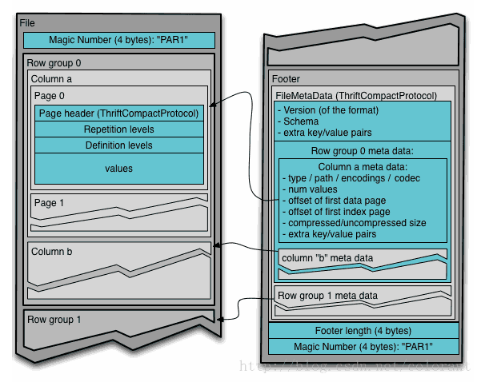
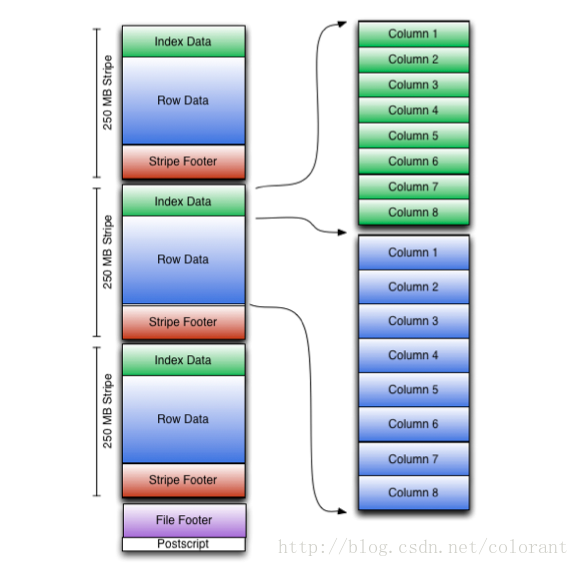

### 为什么列存储数据库读取速度会比传统的行数据库快？

列式存储只需要读取相关的列（而且可以连续整块读取），而行存储需要读取全部数据。这是其中一个很容易理解也很重要的原因。有些人因此认为，当需要读取全部字段时，行数据库和列式数据库性能应该是差不多的。这样的理解有失偏颇。其实，列式存储读取速度快还有很多其他原因。

1. 列式存储把相同类型的数据归在一起，压缩比可以很高，通常能到10%~25%。数据库的瓶颈通常在IO，很高的压缩比，可以大大减轻数据读取的压力，提高响应速度。
2. 除去字符串类型，其他类型的字段通常是固定长度的，而且在磁盘和内存的字节顺序通常是一致的，可以直接映射，省去了解析的过程。而在行存储中，只要有变长的字段存在，需要逐行逐字段的解析。
3. 列式存储可以向量化的处理一个字段。可以将一个列的一整块连续数据读入CPU cache，效率非常高。而且，可以利用CPU的向量化处理指令并行处理一些常用计算，譬如求和，比较大小等等。而这一切在行存储中都做不到。
4. 因为数据表中的数据类型都是用户定义的，开发数据库的各种算子的时候，通常都是虚拟函数。在行存储中，意味着在每一行evaluate这个算子（譬如加法算子）的时候，我们都需要一个很大的case语句，对不同的数据类型分别处理，效率很低。而在列式存储中，极端情况下，对整个列只要做一次case处理就可以了，效率就会很高。当然近几年，很多数据库引擎都引入了JIT，行存储这方面的劣势在缩小。

其实，写数据的时候，如果可以批量处理，列式存储的效率也比行存储要高不少。但是oltp通常是对个别行的增删改，不能进行批处理，因此列存储效率不高，不推荐使用。

### 列式存储

由于OLAP查询的特点，列式存储可以提升其查询性能，但是它是如何做到的呢？这就要从列式存储的原理说起，从图1中可以看到，相对于关系数据库中通常使用的行式存储，在使用列式存储时每一列的所有元素都是顺序存储的。由此特点可以给查询带来如下的优化：

- 查询的时候不需要扫描全部的数据，而只需要读取每次查询涉及的列，这样可以将I/O消耗降低N倍
- 可以保存每一列的统计信息(min、max、sum等)，实现部分的谓词下推。
- 由于每一列的成员都是同构的，可以针对不同的数据类型使用更高效的数据压缩算法，进一步减小I/O。
- 由于每一列的成员的同构性，可以使用更加适合CPU pipeline的编码方式，减小CPU的缓存失效。

### 嵌套数据格式

通常我们使用关系数据库存储结构化数据，而关系数据库支持的数据模型都是扁平式的，而遇到诸如List、Map和自定义Struct的时候就需要用户自己解析，但是在大数据环境下，数据的来源多种多样，例如埋点数据，很可能需要把程序中的某些对象内容作为输出的一部分，而每一个对象都可能是嵌套的，所以如果能够原生的支持这种数据，查询的时候就不需要额外的解析便能获得想要的结果。

### Parquet

Apache Parquet 最初的设计动机是存储嵌套式数据,比如Protocolbuffer thrift json 等 将这类数据存储成列式格式以方便对其高效压缩和编码,且使用更少的IO操作取出需要的数据,也是Parquet 相比于ORC的优势,它能透明的将protobuf 和thrift被广泛的使用的今天,于parquet 进行集成,是一件非常容易和自然地事情,除了上述优势外,相比于ORC,Parquet 没有太多其他可圈可点的地方,比如他不支持update操作(数据写成后不可修改),不支持ACID等.

Parquet的设计方案，整体来看，基本照搬了Dremel中对嵌套数据结构的打平和重构算法，通过高效的数据打平和重建算法，实现按列存储（列组），进而对列数据引入更具针对性的编码和压缩方案，来降低存储代价，提升计算性能。想要了解这一算法逻辑的，可以看Dremel的论文：[Dremel: Interactive Analysis of WebScaleDatasets](http://research.google.com/pubs/pub36632.html)

从文件结构上来看，如下图所示：

基本上就是一个文件由多个列组组成，数据先按列组（rowgroup）分段（也就是先做行切割），然后在列组内部对每个列的数据分列连续存储（columnchunk）（也就第二步做列切割），每个列内部的数据，再细分成page（可以近似的认为是再做行切割），最后，在文件的尾部，存储所有列组的元数据信息

这么分层设计，从并发度的角度考虑，行切割的目的，主要做为任务的切分单元，比如一个Map任务处理一个列组里的数据。然后列切割的目的，除了按需读取数据，也是做为IO的并发单元。最后Page的拆分，主要是从编码和压缩的角度，进行拆分，以page为单位进行压缩编码，如果近似的理解，也可以认为一定程度上起到了内存和CPU上用量的控制，从Parquet文件的层面来说，Page是数据最小的读写单元。

最后，对列数据提供多种编码方式，比如：字典（Dictionary)，游程（RLE），增量（DELTA）等等

综上，Parquet主要还是对Dremel的存储模型这部分的一个实现，在Dremel存储模型定义范围之外，自己额外做的工作，并不多。（这里指的文件格式底层技术实现方面，工程上和大数据生态系各个组件的打通结合方面，还是做了大量的工作的）

### ORC

ORC(optimizedRC File) 存储源自RC(RecordCloimnar File)这种存储格式,RC是一种列式存储引擎,对schema演化(修改schema需要重新生成数据)支持较差,主要是在压缩编码,查询性能方面做了优化.RC/ORC最初是在Hive中得到使用,最后发展势头不错,独立成一个单独的项目.Hive1.xbanbendu版本对事物和update操作的支持,便是给予ORC实现的(其他存储格式暂不支持).
OCR发展到今天,已经具备一些非常高级的feature,比如支持update操作,支持ACID,支持struct,array复杂类型.你可以使用复杂类型构建一个类似parquet的嵌套式数据架构,但层数非常多时,写起来非常麻烦和复杂,而parquet提供的schema表达方式更容易表示出多级嵌套的数据类型.

ORC文件格式的一些基础思想和Parquet很像，也是先按行水平切割，在按列垂直切割，针对不同的列，采用特定的编码格式，最后再进一步对编码后的数据进行压缩。支持的编码格式（游程，字典，增量，bit），压缩格式（zlib，snappy，LZO等等）也基本一致。

一个ORC文件包含多个stripes（每个stripes由多组行数据组成的），一个包含辅助信息的file footer。在文件的结尾，一个postscript保存着压缩参数及被压缩的footer的长度。一个stripes缺省大小是250MB，其大小可以扩展的长度只受HDFS的约束。file footer包含文件中的一个记录stripes信息的列表、每个stripes中行的数目及每个列的数据类型，它也包含列级的聚合结果：count, min, max, and sum。

与Parquet不同的地方是，Parquet对嵌套型数据结构的打散和重构的算法，来源于Dremel，通过两种level信息(definition level,repetition level)来标识特定数据在数据结构中层次位置，这两种信息和具体的列数据直接绑定，仅依靠这些信息和对象整体的Schema就能重构出这一列信息原有的层次结构。

而ORC的实现，更加简单直白一些，类似元素是否为Null的信息，就是一组bit位图，而对于元素个数不定的结构，如List，Map等数据结构，则在虚拟的父结构中维护了一个所拥有的子元素数量的信息。这样的带来的问题是，由单纯的某一叶节点列元素的数据出发，是无法独立构建复原出该列数据的结构层次的，需要借助父元素的辅助元数据才能完整复原。

在实现中，ORC对于每个列（基本的或符合结构的）采用了多个Stream分别存储数据和上述各类元数据。

比如String类型的列，如果使用字典编码，那么会生成4个stream，PRESENT Stream用来标识具体String元素是否为Null，DATA Stream，连续存储字符串自身，DICTIONARY_DATA Stream存储字典信息，LENGTH Stream存储每个元素的长度（用来从DATA Stream中定位和拆分数据）

再比如Map类型的列，使用一个PRESENT Stream来标识具体每个Map元素是否为Null，用LENGTH 
Stream来标识每个Map元素内部有几个对象

这种处理方式对比Dremel，看起来的确老土很多，理论深度上被甩了不止一条街，不过如果对于嵌套层次不复杂的数据结构，也还是简单有效的。但是，ORC的风评最近感觉明显比Parquet要盛，这又是为什么呢？

个人感觉，主要还是工程实现上的问题，除了核心的数据结构的打散和重建逻辑，ORC的文件格式里，还包含了其它的一些工程优化手段。比如索引（并不是传统意义上的全量排序用索引，更接近统计信息，比如列组的min，max，avg，count等信息，可以用作粗过滤手段，也可以覆盖部分聚合计算的需求），比如Bloomfilter等。而Parquet在这些方面有规划，但是目前似乎基本都没有做。

另外，如果仅从Hive的角度来说，一方面ORC是亲儿子，有些工作开展得比较早，另一方面扁平的数据结构，让Parquet在支持嵌套数据结构方面的优势并不能很好的体现，大概也是原因之一吧。

优势：

1. 包含统计信息的索引和Bloomfilter，实现部分的谓词下推

劣势：

1. 扁平的数据结构

### 性能测试

写性能：而Parquet这边，压缩率方面看起来和ORC也没有很明显差距，小幅度的区别的原因应该还是具体Encoding和compress算法的区别。但是CPU耗时方面，明显高出RC和ORC，应该是列打散算法的消耗造成的，也不排除目前Parquet对Dremel算法的应用还有优化的空间。

读性能：再看Parquet，还是同样的问题，CPU的耗时明显要偏高（尽管使用了比RC和ORC更快的Snappy压缩方式）

### 对比

|              | parquet                          | orc                         |
| ------------ | -------------------------------- | --------------------------- |
| 列编码       | 支持多种：字典、RLE、delta编码等 | 与parquet类似               |
| 嵌套结构     | 支持比较完美                     | 复杂，性能和空间损失大      |
| ACID         | 不支持                           | 支持                        |
| update操作   | 不支持                           | 支持                        |
| 统计信息索引 | 粗粒度，block/group/chunk级别    | 粗粒度，file/stripe/row级别 |

> [Scala+Spark教程：RC ORC Parquet 格式比较和性能测试](http://bigdatastudy.net/show.aspx?id=571&cid=9)
>
> [orc格式和parquet格式对比](https://yq.aliyun.com/articles/226990)
>
> [Hive ORC和Parquet](https://blog.csdn.net/jiangshouzhuang/article/details/51416744)
>
> [为什么列存储数据库读取速度会比传统的行数据库快？](https://www.zhihu.com/question/29380943/answer/556258418)