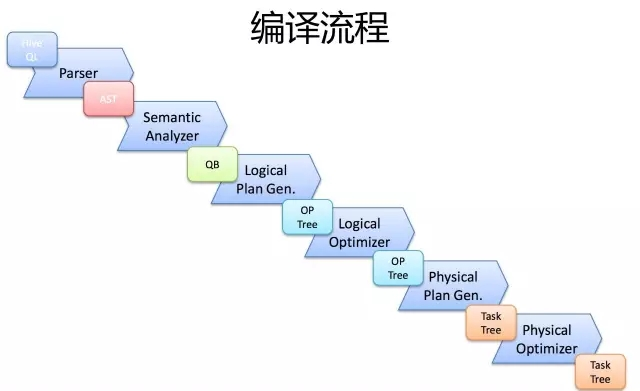
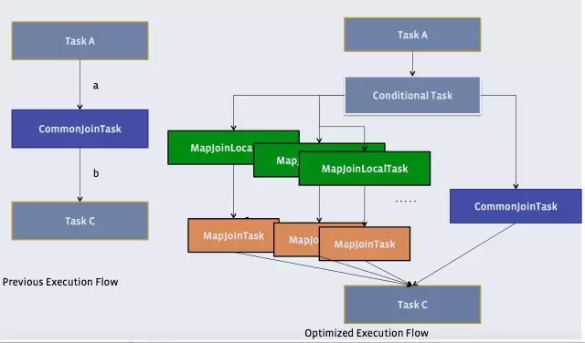

# Hive原理

### 架构

从Facebook的图上可以看出，Hive主要有QL，MetaStore和Serde三大核心组件构成。QL就是编译器，也是Hive中最核心的部分。Serde就是Serializer和Deserializer的缩写，用于序列化和反序列化数据，即读写数据。MetaStore对外暴露Thrift API，用于元数据的修改。比如表的增删改查，分区的增删改查，表的属性的修改，分区的属性的修改等。等下我会简单介绍一下核心，QL。

### 编译流程

一条SQL，进入的Hive。经过上述的过程，其实也是一个比较典型的编译过程变成了一个作业。



首先，Driver会输入一个字符串SQL，然后经过Parser变成AST，这个变成AST的过程是通过Antlr来完成的，也就是Anltr根据语法文件来将SQL变成AST。

AST进入SemanticAnalyzer（核心）变成QB，也就是所谓的QueryBlock。一个最简的查询块，通常来讲，一个From子句会生成一个QB。生成QB是一个递归过程，生成的 ＱＢ经过GenLogicalPlan过程，变成了一个Operator图，也是一个有向无环图。

OP DAG经过逻辑优化器，对这个图上的边或者结点进行调整，顺序修订，变成了一个优化后的有向无环图。这些优化过程可能包括谓词下推（Predicate Push Down），分区剪裁（Partition Prunner），关联排序（Join Reorder）等等

经过了逻辑优化，这个有向无环图还要能够执行。所以有了生成物理执行计划的过程。GenTasks。Ｈive的作法通常是碰到需要分发的地方，切上一刀，生成一道MapReduce作业。如Group By切一刀，Join切一刀，Distribute By切一刀，Distinct切一刀。

这么很多刀砍下去之后，刚才那个逻辑执行计划，也就是那个逻辑有向无环图，就被切成了很多个子图，每个子图构成一个结点。这些结点又连成了一个执行计划图，也就是Task Tree.

把这些个Task Tree 还可以有一些优化，比如基于输入选择执行路径，增加备份作业等。进行调整。这个优化就是由Physical Optimizer来完成的。经过Physical Optimizer，这每一个结点就是一个MapReduce作业或者本地作业，就可以执行了。

这就是一个SQL如何变成MapReduce作业的过程。要想观查这个过程的最终结果，可以打开Hive，输入Explain ＋ 语句，就能够看到。

### Ｇroup By优化

Ｇroup By优化通常有Map端数据聚合和倾斜数据分发两种方式。

**Map端部分聚合**

配置开关是`hive.map.aggr`。也就是执行SQL前先执行 `set hive.map.aggr=true;`它的原理是Map端在发到Reduce端之前先部分聚合一下。来减少数据量。因为我们刚才已经知道，聚合操作是在Reduce端完成的，只要能有效的减少Reduce端收到的数据量，就能有效的优化聚合速度，避免爆机，快速拿到结果。

**针对倾斜的key做两道作业的聚合**

什么是倾斜的数据？比如某猫双11交易，华为卖了1亿台，苹果卖了10万台。华为就是典型的倾斜数据了。如果要统计华为和苹果，会用两个Reduce作Group By，一个处理1亿台，一个处理10万台，那个1亿台的就是倾余。

可以使用`hive.groupby.skewindata`选项，通过两道MapReduce作业来处理。当选项设定为 true，生成的查询计划会有两个 MR Job。第一个 MR Job 中，Map 的输出结果集合会随机分布到Reduce 中，每个 Reduce 做部分聚合操作，并输出结果，这样处理的结果是相同的 Group By Key有可能被分发到不同的 Reduce 中，从而达到负载均衡的目的；第二个 MR Job 再根据预处理的数据结果按照 Group ByKey 分布到 Reduce 中（这个过程可以保证相同的 Group By Key 被分布到同一个 Reduce中），最后完成最终的聚合操作。 

1. 无论你使用Map端，或者两道作业。其原理都是通过**部分聚合**来来减少数据量。

2. 能不能部分聚合，部分聚合能不能有效减少数据量，通常与UDAF，也就是聚合函数有关。

   也就是只对**代数聚合函数**有效，对**整体聚合函数**无效。

   所谓代数聚合函数，就是由部分结果可以汇总出整体结果的函数，如count，sum。 

   所谓整体聚合函数，就是无法由部分结果汇总出整体结果的函数，如avg，mean。

### JOIN优化

Map Join通常只适用于一个大表和一个小表做关联的场景，例如事实表和维表的关联。

原理如上图，用户可以手动指定哪个表是小表，然后在客户端把小表打成一个哈希表序列化文件的压缩包，通过分布式缓存均匀分发到作业执行的每一个结点上。然后在结点上进行解压，在内存中完成关联。

Map Join全过程不会使用Reduce，非常均匀，不会存在数据倾斜问题。默认情况下，小表不应该超过25M。在实际使用过程中，手动判断是不是应该用Map Join太麻烦了，而且小表可能来自于子查询的结果。

Hive有一种稍微复杂一点的机制，叫Auto Map Join。还记得原理中提到的物理优化器？Physical Optimizer么？它的其中一个功能就是把Join优化成Auto Map Join。



优化过程是把Join作业前面加上一个条件选择器ConditionalTask和一个分支。左边的分支是MapJoin，右边的分支是Common Join(Reduce Join)

Ｈive 也可以通过像Group By一样两道作业的模式单独处理一行或者多行倾斜的数据。

```
set hive.optimize.skewjoin = true; 
set hive.skewjoin.key = skew_key_threshold （default = 100000）
```

其原理是就在Reduce Join过程，把超过十万条的倾斜键的行写到文件里，回头再起一道Join单行的Map Join作业来单独收拾它们。最后把结果取并集就是了。如上图所示。

>  [Hive原理及查询优化](https://blog.csdn.net/LW_GHY/article/details/51469753)
>
> [Hive中Join的原理和机制](http://lxw1234.com/archives/2015/06/313.htm)

