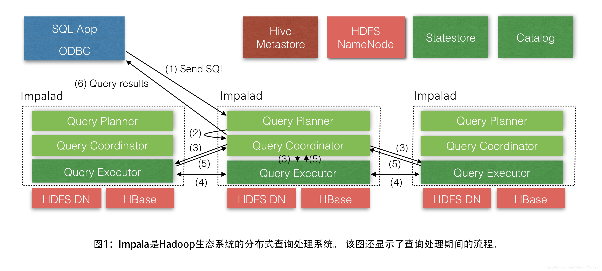
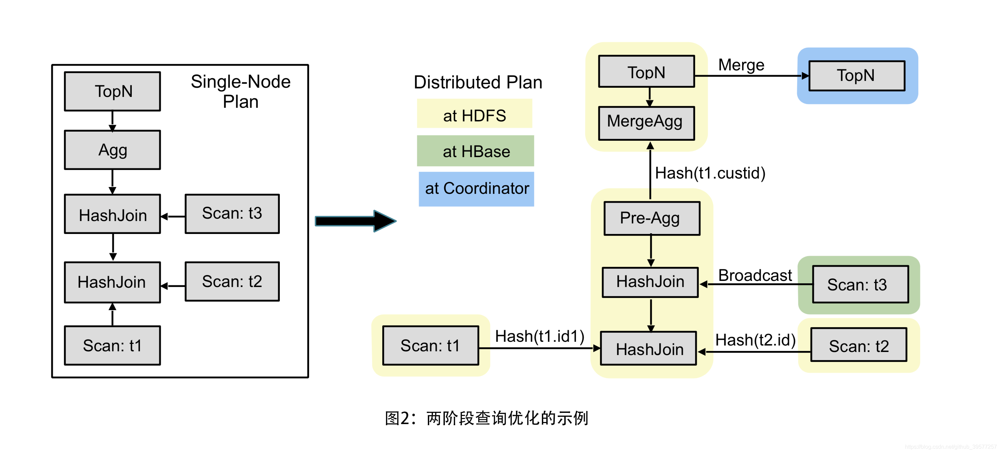
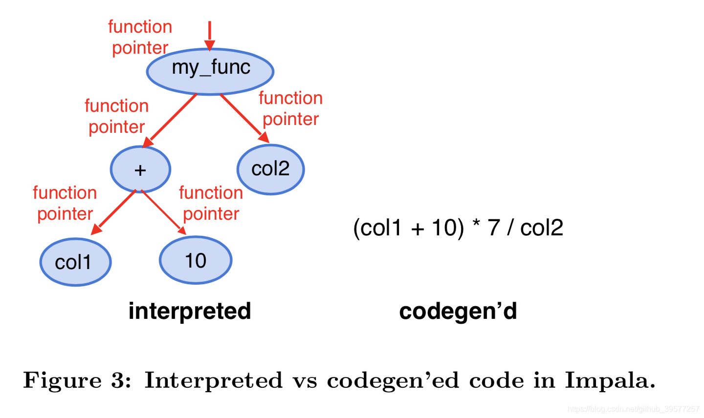
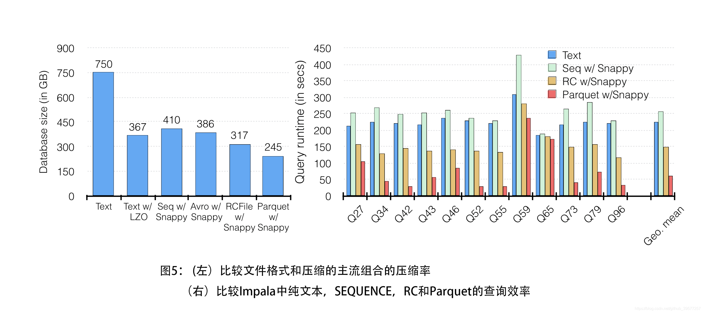
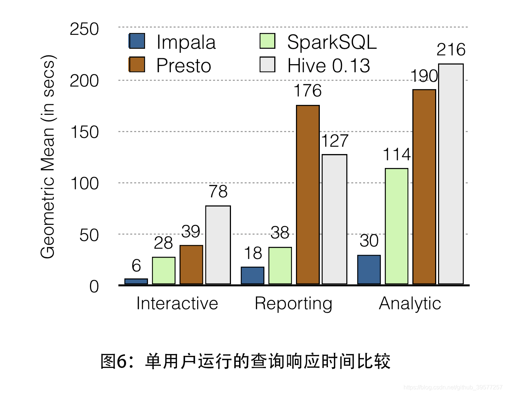
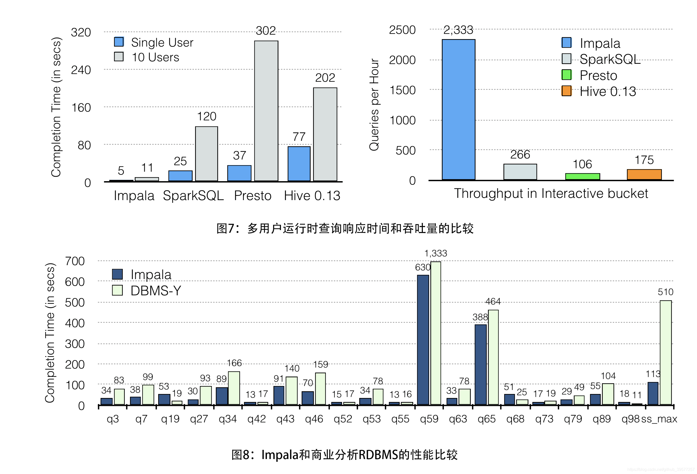

# 【转】【译】Impala：Hadoop上的一个现代开源SQL引擎

转自：[Impala: A Modern, Open-Source SQL Engine for Hadoop （Impala：适用于Hadoop的现代开源SQL引擎）](https://blog.csdn.net/github_39577257/article/details/93366028)

## 摘要

Cloudera Impala 是一个现代化的开源 MPP SQL引擎，完全为Hadoop数据处理环境而设计。 Impala 为 Hadoop上 的 BI或者以读为主的分析提供低延迟和高并发性，而不是由Apache Hive等批处理框架提供。本文从用户的角度介绍了Impala，概述了其架构和主要组件，并简要论述了与其他流行 SQL-on-Hadoop 系统相比的优越性能。

## 1. 简介

Impala是一个开源的^[1]^ 、完全集成的、最先进的 MPP SQL 查询引擎，专门为 Hadoop 的灵活性和可扩展性而设计。 Impala的目标是将熟悉的SQL支持和传统分析型数据库的多用户性能与 Apache Hadoop 的可扩展性和灵活性以及 Cloudera Enterprise 的生产级别的安全和管理扩展相结合。 Impala的beta版于2012年10月发布，并于2013年5月发布GA。最新版本 Impala 2.0 于2014年10月发布。Impala 的生态系统势头继续加速，自GA以来下载量接近100万。

与其他系统（通常是 Postgres 的分支）不同，Impala 是一个全新的引擎，用C ++和Java从头编写。 它通过使用标准组件（HDFS、HBase、Metastore、YARN、Sentry）来保持 Hadoop 的灵活性，并且能够读取大多数广泛使用的文件格式（例如Parquet、Avro、RCFile）。 为了减少延迟，例如采用 MapReduce 或远程读取数据所产生的延迟，Impala实现了一个基于守护进程的分布式体系结构，该进程负责查询执行的所有方面，并在与Hadoop其余基础部分运行在相同的机器上。 结果是性能相当或优于商用MPP分析DBMS，具体取决于特定的工作负载。

本文讨论了Impala为用户提供的服务，然后概述了其架构和主要组件。 目前使用HDFS作为底层存储管理器的可实现的最高性能，因此这是本文的重点; 当某些技术方面与HBase在处理方式上存在显著差异时，我们在文中没有详细说明。

Impala是性能最高的SQL-on-Hadoop系统，尤其是在多用户工作负载下。 如第7节所示，对于单用户查询，Impala比其他选项快13倍，平均速度快6.7倍。 对于多用户查询，差距扩大：Impala比其他选择项快27.4倍，平均速度提高18倍 - 或者说多用户查询的平均速度比单用户查询快近三倍。

本文的其余部分结构如下：下一部分从用户的角度概述了Impala，并指出它与传统RDBMS的不同之处。 第3节介绍了系统的整体架构。 第4节展示了fe组件，其中包括基于代价的分布式查询优化器，第5节展示了be组件，它负责执行查询并使用运行时代码生成器，第6节展示资源/工作负载管理组件。 第7节简要评估了Impala的性能。 第8节讨论了前面的路线图，第9节总结。

## 2. Impala的用户视图

Impala 是一个集成到Hadoop环境中的查询引擎，它使用了许多标准的Hadoop组件（Metastore、HDFS、HBase、YARN、Sentry），以提供类似RDBMS的体验。 尽管如此，本节的其余部分将提出一些重要的区别。

Impala 专门用于与标准商业智能环境集成，并为此支持大部分相关行业标准：客户端可以通过 ODBC 或 JDBC 连接; 身份验证是使用 Kerberos 或 LDAP 完成的; 授权遵循标准SQL角色和权限^[2]^ 。 为了查询HDFS已存在的数据，用户通过熟悉的`CREATE TABLE`语句创建表，该语句除了提供数据的逻辑模式之外，还可以指明物理布局，例如文件格式和HDFS目录结构位置。 之后就可以使用标准SQL语法查询这些表。

### 2.1 物理架构设计

创建表时，用户还可以指定分区列的列表：

```sql
CREATE TABLE T (...) PARTITIONED BY (day int, month int) LOCATION ’<hdfs-path>’ STORED AS PARQUET;
```

对于未分区的表，数据文件默认直接存储在根目录中 ^[3]^ 。对于分区表，数据文件放在子目录中，其路径反映了分区列的值。 例如，对于表T的第17天，第2个月，所有数据文件都将位于目录`<root>/day=17/month=2/`中。 注意，这种形式的分区并不意味着单个分区的数据的排列：分区的数据文件的块在HDFS数据节点上随机分布。

Impala 还为用户在选择文件格式时提供了极大的灵活性。它目前支持压缩和未压缩的textFile，sequenceFile（可拆分的文本文件形式），RCFile（传统的列式格式），Avro（二进制行式格式）和Parquet，最高性能的存储选项（第5.3节更详细地讨论了文件格式）。 如上例所示，用户在`CREATE TABLE`或`ALTER TABLE`语句中指明存储格式。 也可以单独为每个分区选择单独的格式。 例如，可以使用以下方法将特定分区的文件格式专门设置为 Parquet：`ALTER TABLE PARTITION(day=17, month=2) SET FILEFORMAT PARQUET`。

作为一个有用的示例，请考虑一个按时间顺序记录数据的表，例如点击日志。 当天的数据可能以CSV文件的形式出现，并在每天结束时批量转换为Parquet。

### 2.2 SQL 支持

Impala支持大多数`SQL-92 SELECT`语句语法，以及额外的SQL-2003`分析函数，和大多数标准标量数据类型：整型和浮点类型，`STRING，CHAR，VARCHAR，TIMESTAMP和精度最高38位的`DECIMAL`。 自定义应用程序逻辑可以通过 Java 和C++ 中的用户自定义函数（UDF）和用户自定义的聚合函数（UDA， 目前仅支持C ++）集成。

由于HDFS作为存储管理器的限制，Impala不支持`UPDATE`或`DELETE`，基本上只支持批量插入（`INSERT INTO ... SELECT ...`） ^[4]^。 与传统的 RDBMS 不同，用户只需使用 HDFS 的 API 将数据文件复制或移动到该表的目录位置即可将数据添加到表中。 或者可以使用`LOAD DATA`语句完成相同的操作。

与批量插入类似，Impala 通过删除表分区（`ALTER TABLE DROP PARTITION`）来支持批量数据删除。 由于无法就地更新 HDFS 文件，因此 Impala 不支持`UPDATE`语句。 相反用户通常会重新计算部分数据集以合并更新，然后通常通过删除和重新添加分区来替换相应的数据文件。

在初始化数据加载之后，或者当表的大部分数据发生变化时，用户应该运行`COMPUTE STATS <table>`语句，该语句指示 Impala 收集表的统计信息。 随后将在查询优化期间使用这些统计信息。

## 3. 架构

Impala 是一个大规模并行查询执行引擎，可在现有Hadoop 集群中的数百台计算机上运行。 与传统的关系数据库管理系统(RDBMS)查询处理和底层存储引擎是单个紧耦合系统的组件不同，它与底层存储引擎解耦。 Impala 的高层架构如 图1 所示。



Impala部署由三个服务组成。 Impala守护进程（impalad）服务负责接收来自客户端程序的查询并协调它们在集群中的执行，以及代其他 Impala 守护进程执行单独的查询片段。 当Impala守护进程以第一角色管理查询的执行时，它被称为该查询的`coordinator`。 但是所有Impala守护进程都是对称的; 他们都可能在所有角色中运作。 此性质有助于容错和负载平衡。

一个 Impala 守护进程部署在集群中的每台机器上，该机器也运行datanode进程 - 底层HDFS部署的块服务器 - 因此每台机器上通常都有一个 Impala 守护进程。 这允许 Impala 利用数据本地性，并从文件系统中读取block而无需使用网络。

StateStore守护进程（statestored）是Impala的元数据发布-订阅服务，它将集群范围的元数据传播到所有Impala进程。 集群有一个statestored的实例，在下面的第3.1节中有更详细的描述。

最后，第3.2节中描述的Catalog进程（catalogd）充当 Impala 的目录存储库和元数据访问网关。 通过 catalogd，Impala守护进程可以执行映射在外部目录存储（如Hive Metastore）中的DDL命令。 通过 statestore 广播系统目录的更改。

所有这些 Impala 服务，以及一些配置选项，例如资源池的大小、可用内存等（有关资源和工作负载管理的更多详细信息，请参阅第6节），也输出到了Cloudera Manager（一个复杂的集群管理应用程序） 。 Cloudera Manager 不仅可以管理 Impala，还可以管理几乎所有服务，以便全面了解 Hadoop 部署。

### 3.1 状态分布

在数百个节点上运行的MPP数据库在设计上最主要的挑战是群集范围元数据的协调和同步。Impala 的对称节点架构要求所有节点必须能够接受和执行查询。 因此，所有节点必须具有系统catalog的最新版本和Impala集群成员资格的最新视图，以便可以正确地调度查询。

我们可能通过部署单独的集群管理服务来解决此问题，该服务具有所有集群范围真实状态版本的元数据。 然后 Impala 守护进程可以惰性查询该存储（即仅在需要时），这将确保所有查询都被给予最新响应。 但是 Impala 设计的一个基本原则是尽可能避免在任何查询的关键路径上使用同步RPC。 在没有密切关注这些成本的情况下，我们发现查询延迟通常会受到建立TCP连接或加载某些远程服务所花费的时间的影响。 相反，我们设计了Impala“推送”更新到所有感兴趣的各方，并设计了一个名为statestore的简单发布-订阅服务，以将元数据更改传播给一组订阅者。

statestore 维护一组 Topic，这些topic是（key,value,version）三元组的数组，称为`entries`，其中’key’和’value’是字节数组，'version’是64位整数。topic 由应用程序定义，因此 statestore 不了解任何 topic 条目的内容。 topic 在 statestore 的生命周期内是持久的，但在服务重新启动时不会持久存在。 希望接收任何topic更新的进程称为订阅者，并通过在启动时向 statestore 注册并提供topic列表来表达他们的兴趣。 statestore 通过向订阅者发送每个已注册topic的初始topic更新来响应注册，该topic由当前在该topic中的所有条目组成。

注册后 statestore 会定期向每个订阅者发送两种消息。 第一种消息是topic更新，包括自上次更新成功发送到订阅者以来对topic的所有更改（新增条目，修改的条目和删除的条目）。 每个订阅者都维护一个每个topic最新版本的标识符，该标识符允许 statestore 仅发送增量更新。 每个订阅者发送其对其订阅topic更改的列表来响应topic更新， statestore会保证订阅者在收到下一次更新时应用这些更改。

第二种 statestore 消息是 keepalive。 statestore 使用 keepalive 消息来维护与每个订阅者的连接，否则会超时其订阅并尝试重新注册。 以前版本的 statestore 使用topic更新消息用于这两个目的，但随着topic更新大小的增加，很难确保及时向每个订阅者传递更新，从而导致订阅者的故障检测过程出现误报。

如果 statestore 检测到失败的订阅者（例如，keepalive 投递重复失败），它将停止发送更新。 某些topic条目可能会标记为“瞬态”，这意味着如果“拥有”他们的订阅者失败，则会将其删除。 这是一个固有的原语，用于在专用topic中维护集群的活跃度信息，以及每个节点的负载统计信息。

statestore 提供了非常弱的语义：订阅者可能以不同的速率更新（尽管 statestore 尝试公平地分发topic更新），因此可能对topic内容有非常不同的视图。 但是，Impala仅使用topic元数据在本地进行决策，而不会在群集之间进行任何协调。 例如，基于 catalog 元数据topic在单个节点上执行查询计划，并且一旦计算出完整计划，执行该计划所需的所有信息都直接分发到执行节点。 不要求执行节点应该知道 catalog 元数据topic的相同版本。

虽然现有 Impala 部署中只有一个 statestore 进程，但我们发现它可以很好地扩展到中型群集，并且通过一些配置，可以为我们更大的部署提供服务。 statestore 不会将任何元数据保存到磁盘：所有当前元数据都会被实时订阅者推送到 statestore（例如加载信息）。因此，如果statestore重新启动，其状态可以在初始订阅者注册阶段恢复。 或者如果运行 statestore 的机器出现故障，则可以在其他机器启动新的 statestore 进程，并且订阅者可以故障转移到该状态。 Impala中没有内置的故障转移机制，而是部署通常使用可重定向的DNS条目来强制订阅者自动移动到新的流程实例。

### 3.2 目录服务

Impala 的目录服务通过 statestore 广播机制向 Impala  daemon 提供目录元数据，并为 Impala  daemon 执行DDL操作。目录服务从第三方元数据存储（例如 Hive Metastore或HDFS Namenode）中拉取信息，并将该信息聚合为Impala兼容的目录结构。 这种架构允许 Impala 相对不依赖于它所依赖的存储引擎的元数据存储，这使我们能够相对快速地向 Impala 添加新的元数据存储（例如HBase支持）。系统目录的任何更改（例如当加载新表时）都通过statestore传播。

目录服务还允许我们使用 Impala 特定信息来扩充系统目录。 例如，我们仅使用目录服务注册用户自定义的函数（例如不将其复制到Hive Metastore），因为它们特定于 Impala。

由于目录通常非常大并且对表的访问很少是统一的，目录服务仅为它在启动时发现的表加载一个框架条目。 更详细的表元数据可以在第三方存储的后台懒加载。如果在完全加载表之前需要表，则Impala daemon 将检测到此情况并向目录服务发出优先级请求。 此请求将阻塞，直到表完全加载。

## 4. 前端

Impala 前端负责将SQL文本编译为 Impala 后端可执行的查询计划。 它是用 Java 编写的，由一个功能齐全的SQL解析器和基于代价的查询优化器组成，所有这些都是从头开始实现的。 除了基本的SQL功能（select，project，join，group by，order by，limit）之外，Impala还支持内联视图，不相关和相关的子查询（被重写为join）， `outer joins` 的所有变体以及显式的`left/right`半连接和`anti-joins`和分析窗口功能。

查询编译过程遵循传统的分工：查询解析，语义分析和查询计划/优化。 我们将重点关注后者，也是最具挑战性查询编译部分。 解析树以及在语义分析期间收集的查询全局信息（表/列标识符，等价类等）作为Impala 查询计划器的输入。 可执行查询计划分两个阶段构建：（1）单节点计划和（2）并行化和分段计划。

在第一阶段，解析树被转换为不可执行的单节点计划树，由以下计划节点组成：HDFS/HBase扫描，hash join，cross join，uniob，hash聚合，排序，top-n和分析求值。 此步骤负责在最低可能的计划节点上分配谓词，依据等价类推断谓词，修剪表分区，设置limits/offsets，应用列投影，以及执行一些基于代价的计划优化，例如排序和合并分析窗口函数，连接重排序以最小化总计算代价。 代价预估基于表/分区基数加上每列的不同值计数 ^[6]^ ; 直方图目前不是统计数据的一部分。 Impala使用简单的启发式方法来避免在常见情况下详尽地枚举和计算整个 join-order 空间。

第二个计划阶段将单节点计划作为输入，并生成分布式执行计划。 **总体目标是最小化数据移动并最大化扫描本地性**：在HDFS中，远程读取比本地读取慢得多。 通过在必要时在计划节点之间添加交换节点以及通过添加额外的非交换计划节点来最小化跨网络的数据移动（例如，本地聚合节点）来分布该计划。 在第二阶段，我们选定每个连接节点的连接策略（此时连接顺序是固定的）。 支持的连接策略是**broadcast**和partitioned。 前者将连接的整个构建复制到执行探测的所有集群机器，后者在连接表达式上重新分配构建和探测端。 Impala 选择估计的策略来最小化网络交换的数据量，同时利用join输入的现有数据分区。

所有聚合当前都是先本地预聚合执行，然后执行合并聚合操作。 对于分组聚合，预聚合的输出按分组表达式分区，并且合并聚合在所有参与节点上并行完成。 对于非分组聚合，合并聚合在单个节点上完成。 Sort和top-n以类似的方式并行化：一个分布式本地排序/top-n之后是单节点合并操作。 基于分区表达式并行化分析表达式的求值。 它依赖于其输入按`partition-by/order-by`表达式排序。 最后，分布式计划树在交换边界处分开。 计划的每个这样的部分都放在一个计划片段（Impala的后端执行单元）内。 计划片段封装了计划树的一部分，该计划树在单个机器上的相同数据分区上运行。

图2用一个例子说明了查询计划的两个阶段。图的左侧显示了连接两个HDFS表(t1,t2)和一个HBase表(t3)的查询的单节点计划，其后是聚合和按限定条数(top-n)的排序。右侧显示分布式，分散的计划。圆角矩形表示片段边界，箭头表示数据交换。表t1和t2通过分区策略连接。扫描位于它们自己的片段中，因为它们的结果立即交换给在基于散列的数据分区上操作的消费者（连接节点），而表数据是随机分区的。以下与t3的连接是放置在与t1和t2之间的连接相同的片段中的广播连接，因为广播连接保留了现有数据分区（连接t1，t2和t3的结果仍然基于连接键进行散列分区t1和t2）。在连接之后，我们执行两阶段分布式聚合，其中在与最后一个连接相同的片段中计算预聚合。预聚合结果基于分组key进行散列交换，然后再次聚合以计算最终聚合结果。相同的两阶段方法应用于top-n，最后的top-n步骤在coordinator处执行，coordinator将结果返回给用户。



## 5. 后端

Impala的后端从前端接收查询片段，并负责快速执行。 它旨在利用现代硬件。 后端是用C++ 编写的，并且在运行时使用代码生成器来生成有效的代码路径（关于指令计数）和小的内存开销，特别是与用Java实现的其他引擎相比。

Impala利用数十年的并行数据库研究。 执行模型是具有 Exchange算子的传统Volcano 风格[7]。 处理是一次执行一批：每个`GetNext()`调用都在一批行上运行，类似于[10]。 除了`stop-and-go`算子（例如排序）之外，执行是完全可管道化的，这最小化了用于存储中间结果的内存消耗。 在内存中处理时，元组具有规范的位于内存的面向行的格式。

可能需要占用大量内存的操作算子可以根据需要将部分工作集溢写到磁盘。可溢写的算子是hash连接，（基于hash）聚合，排序和分析函数求值。

Impala 对hash连接和聚合算子采用分区方法。也就是说每个元组的哈希值的一些位确定目标分区，剩余位用于哈希表探测。 在正常操作期间，当所有哈希表都适合内存时，分区步骤的开销很小，在非溢写的非基于分区的实现的性能的10％内。 当存在内存压力时，受影响分区可能会溢写到磁盘，从而为其他分区释放内存以完成其处理。 当为hash-join构建hash表并且构建端关系的基数减少时，我们构造一个Bloom过滤器，然后将其传递给探测侧扫描器，实现简单版本的 semi-join。

```
IntVal my_func(const IntVal & v1, const IntVal & v2){
    return IntVal(v1.val * 7 / v2.val);
}
```



### 5.1 运行时代码生成器

使用LLVM [8] 生成运行时代码是 Impala 后端广泛采用的一种技术，可以缩短执行时间。 典型代表性的工作负载性能提升5倍或更高。

LLVM 是一个编译器库和相关工具的集合。 与作为独立应用程序实现的传统编译器不同，LLVM设计为模块化和可重用的。 它允许像Impala这样的应用程序在正在运行的进程中执行just-in-time（JIT）编译，具有现代优化器的全部优点，通过为编译过程的所有步骤公开单独的API能够为许多体系结构生成机器代码。

Impala 使用运行时代码生成器来生成对性能至关重要的特定于查询的函数版本。 特别地，代码生成应用于“内层循环”函数，即在给定查询中多次执行（对于每个元组）的函数，因此构成查询执行总时间的大部分。 例如，将数据文件中的记录解析为Impala的内存中元组格式的函数必将被每个扫描的数据文件中的每个记录调用。 对于扫描大型表的查询，这可能是数十亿条记录或更多。 因此，此函数必须非常高效以获得良好的查询性能，甚至从函数执行中删除一些指令也会导致查询速度加快。


在没有代码生成的情况下，为了处理编译时程序未知的运行时信息，几乎总是需要函数低效率的执行。 例如，仅处理整数类型的记录解析函数在解析仅整数文件时比处理其他数据类型（如字符串和浮点数）的函数更快。 但是，要扫描的文件的schema在编译时是未知的，因此只能使用通用函数，即使在运行时已知更多有限的功能就足够了。

大量运行时的开销来源是虚函数。虚函数调用会产生很大的性能损失，特别是当被调用函数非常简单时，因为调用无法内联。如果在运行时已知对象实例的类型，我们可以使用代码生成来替换虚函数调用，直接调用正确的函数，然后就可以内联了。这在表达式树求值时尤其有用。在Impala中（如在许多系统中），表达式是由独立的运算符和函数的树组成，如图3的左侧所示。可以出现在树中的每种表达式的类型都是通过重写表达式基类中的虚函数来实现的，该函数以递归方式调用其子表达式。许多这些表达函数非常简单，例如，两个数字加和。因此，调用虚函数的代价通常远远超过实际求值函数的代价。如图3所示，通过使用代码生成解决虚函数调用，然后内联生成的函数调用，表达式树可以被直接求值，而无函数调用开销。此外，内联函数增加了指令级并行性，并允许编译器进一步优化，例如跨表达式的子表达式消除。

总的来说，JIT编译的效果类似于对一个查询定制编码。 例如，它消除了分支、循环展开、广播常量、偏移和指针、内联函数。 代码生成对性能产生深刻影响，如图4所示。 例如，在一个10个节点的集群中，每个节点有8核数，48GB RAM和12个磁盘，我们测量了codegen的影响。我们正在使用缩放因子100的 Avro TPC-H数据库，我们运行简单的聚合查询。 代码生成将执行速度提高了5.7倍，增速随着查询复杂性的增加而增加。

### 5.2 I/O管理

从HDFS高效地检索数据对于所有SQL-on-Hadoop系统来说都是一项挑战。为了以硬件速度或接近硬件速度从磁盘和内存执行数据扫描，Impala使用称为**short-circuit local reads** [3] 的HDFS功能，在从本地磁盘读取时绕过DataNode协议。 Impala几乎可以以磁盘带宽速度（每个磁盘大约100MB/s）读取，并且通常能够使所有可用磁盘饱和。 我们测量了12个磁盘，Impala能够以1.2GB/秒的速度维持IO。 此外，HDFS缓存 [2] 允许Impala以内存总线速度访问内存驻留数据，并且还可以节省CPU周期，因为无需为他们复制数据块和校验。

从存储设备读写数据是I/O管理器组件的责任。 I/O管理器为每个物理磁盘分配固定数量的工作线程（每个旋转磁盘一个线程，每个SSD八个），为客户端（例如扫描器线程）提供异步接口。 最近， [6] 证实了Impala的I/O管理器的有效性，这表明Impala的读取吞吐量比其他测试系统高4倍至8倍。

### 5.3 存储格式

Impala支持最流行的文件格式：Avro、RC、Sequence、纯文本和Parquet。 这些格式可以与不同的压缩算法结合使用，例如snappy、gzip、bz2。

在大多数用例中，我们建议使用Apache Parquet，这是一种最先进的开源列式文件格式，可提供高压缩和高扫描效率。 它由Twitter和Cloudera开发，包含来自Criteo、Stripe、Berkeley AMPlab和LinkedIn的贡献。 除了Impala之外，大多数基于Hadoop的处理框架（包括Hive，Pig，MapReduce和Cascading）都能够处理Parquet。

简单地说，Parquet是一种可定制的类似PAX的 [1] 格式，针对大型数据块（数十，数百，数千兆字节）进行了优化，内置支持嵌套数据。 受Dremel的ColumnIO格式 [9] 的启发，Parquet按列存储嵌套字段，并使用最少的信息对其进行扩充，以便在扫描时从列数据重新组装嵌套结构。 Parquet有一组可扩展的列编码。 1.2版支持运行长度和字典编码，2.0版增加了对delta和优化字符串编码的支持。 最新版本（Parquet 2.0）还实现了内置统计数据：内联列统计信息，用于进一步优化扫描效率，例如： 最小/最大索引。

如上所述，Parquet提供高压缩和高扫描效率。 [图5]（左）比较了存储在一些流行的文件格式和压缩算法组合中的缩放因子1,000的TPC-H数据库的Lineitem表的磁盘大小。 带有snappy压缩的 Parquet 可实现最佳压缩效果。 类似地，[图5]（右）显示了当数据库以纯文本，Sequence，RC和Parquet格式存储时，来自TPC-DS基准的各种查询的Impala执行时间。 Parquet的表现始终优于所有其他格式的5倍。



## 6. 资源/工作负载管理

任何集群框架的主要挑战之一是仔细控制资源消耗。 Impala通常在繁忙集群的环境中运行，其中MapReduce任务，摄取作业和定制框架竞争有限的CPU，内存和网络资源。 困难在于协调查询之间以及可能在框架之间的资源调度，而不会影响查询的延迟或吞吐量。

Apache YARN [12] 是Hadoop集群上资源调度的当前标准，它允许框架在不对集群进行分区的情况下共享CPU和内存等资源。 YARN具有集中式体系结构，其中框架对CPU和内存资源进行请求，这些资源由中央资源管理器服务仲裁。 该体系结构的优点是促使在完全了解集群状态的情况下做出决策，但它也会在资源获取方面造成显著的延迟。 由于Impala以每秒数千个查询的工作负载为目标，因此我们发现资源请求和响应周期过长。

我们解决这个问题的方法有两个方面：首先，我们实施了一个互补但独立的准入控制机制，允许用户控制他们的负载而无需昂贵的集中决策。 其次，我们设计了一个中介服务，位于Impala和YARN之间，目的是纠正一些阻抗不匹配。 此服务称为`Llama`既低延迟应用主节点，它实现了资源缓存，群组调度和增量分配更改，同时仍将实际调度决策推迟到YARN，以用于未达到Llama缓存的资源请求。

本节的余下部分介绍了使用Impala进行资源管理的两种方法。 我们的长期目标是通过单一机制支持混合工作负载资源管理，该机制既支持准入控制的低延迟决策，又支持YARN的跨框架支持。

### 6.1 Llama和YARN

Llama是一个独立的 daemon ，所有Impala daemon 都会向它发送每个查询的资源请求。 每个资源请求都与资源池相关联，资源池定义查询可能使用的集群可用资源的公平份额。

如果资源池的资源在Llama的资源缓存中可用，则Llama会立即将它们返回给查询。 这种快速路径允许Llama在资源争用较低时绕过YARN的资源分配算法。 否则，Llama将请求转发给YARN的资源管理器，并等待返回所有资源。 这与YARN的`drip-feed`分配模型不同，后者在分配资源时返还资源。 Impala的流水线执行模型要求所有资源同时可用，以便所有查询片段可以并行进行。

由于查询计划的资源估计（尤其是非常大的数据集）通常不准确，因此我们允许Impala查询在执行期间调整其资源消耗预估。YARN不支持这种模式，相反，我们让Llama向YARN发出新的资源请求（例如，每个节点要求多1GB内存），然后从Impala的角度将它们聚合到一个资源分配中。 这种适配器架构允许Impala与YARN完全集成，而不会承受处理不合适的编程接口的复杂性。

### 6.2 准入控制

除了与YARN集成以进行集群范围的资源管理之外，Impala还具有内置的准入控制机制来限制传入的请求。根据策略请求被分配给资源池并被准入、排队或拒绝，该策略定义每个池的最大并发请求数和请求的最大内存使用量的限制。准入控制器被设计为快速且去中心化的，因此可以在不向中央服务器发出同步请求的情况下接纳对任何Impala daemon 的传入请求。做出准入决策所需的状态通过statestore在Impala daemon中传播，因此每个Impala daemon 都能够根据其全局状态的聚合视图做出准入决策，无需在请求执行路径上进行任何其他同步通信。但是，由于共享状态是异步接收的，因此Impala daemon 可能会局部性地做出决策，导致超出策略指定的限制。在实践中，这不是问题，因为状态通常比大查询更快地更新。此外，准入控制机制主要设计为简单的节流机制而不是诸如YARN的资源管理解决方案。

资源池是按层次定义的。 根据放置策略请求将被分配给资源池，并且可以使用ACL控制对池的访问。 配置是由一个YARN公平调度器分配文件和Llama配置来指定，Cloudera Manager提供简单的用户界面来配置资源池，可以在不重新启动任何正在运行服务的情况下对其进行修改。

## 7. 评估

本节的目的不是要详尽地评估Impala的性能，而主要是为了给出一些指示。 有独立的学术研究得出了类似的结论，例如： [6]。

### 7.1 实验装置

所有实验都在同一个21节点集群上运行。 集群中的每个节点都是一台2插槽机器，配备6核Intel Xeon CPU E5-2630L，频率为2.00GHz。 每个节点都有64GB RAM和12个932GB磁盘驱动器（一个用于操作系统，其余用于HDFS）。

我们在15TB规模因子数据集上运行由TPC-DS的一部分查询组成的`decision-support`风格标准检查程序。 在下面的结果中，我们根据访问的数据量将查询分类为交互式、报告和深层分析查询。 特别是，交互式bucket包含查询：q19，q42，q52，q55，q63，q68，q73和q98; 报告存储bucket包含查询：q27，q3，q43，q53，q7和q89; 并且深度分析bucket包含查询：q34，q46，q59，q79和ss max。 我们用于这些测量的工具是公开提供的[7]。

我们的对比使用了最流行的SQL-on-Hadoop系统，我们能够显示结果 [8] ：Impala，Presto，Shark，SparkSQL和Hive 0.13。 由于在Impala之外的所有测试引擎中缺少基于成本的优化器，我们测试了所有已经转换为SQL-92样式连接的查询的引擎。 为了保持一致性，我们针对Impala运行了相同的查询，但Impala在没有这些修改的情况下生成相同的结果。

每个引擎都按照它最佳的文件格式进行评估，同时始终使用Snappy压缩来确保公平比较：Apache Parquet上的Impala，ORC上的Hive 0.13，RCFile上的Presto和Parquet上的SparkSQL。

### 7.2 单用户性能

[图6]比较了四个系统在单用户运行中的性能，其中一个用户以零思考时间重复提交查询。。 Impala在所有运行的查询中优于单用户工作负载的所有备选方案。 Impala的性能优势范围为2.1x至13.0x，平均速度提高6.7倍。 实际上，与早期版本的Impala [9] 相比，Hive 0.13（从平均4.9x到9x）和Presto（平均从5.3x到7.5x）的性能优势差距更大。



### 7.3 多用户性能

Impala的卓越性能在多用户工作负载中变得更加明显，这些工作负载在实际应用中无处不在。 图7（左）显示了当有10个并发用户从交互式类别提交查询时四个系统的响应时间。 在这种情况下，从单用户到并发用户工作负载时，Impala的性能优于其他系统，从6.7倍到18.7倍。 根据比较，加速度从10.6x到27.4x不等。 请注意，Impala在10个用户负载下的速度几乎是单用户负载下的一半，而替代方案中的平均值仅为单用户负载下的平均值的五分之一。

同样，图7（右）比较了四个系统的吞吐量。 当10个用户从交互式存储桶提交查询时，Impala的吞吐量比其他系统高8.7倍至22倍。

### 7.4 与商业RDBMS进行比较

从上面的比较可以看出，Impala在性能方面处于SQL-on-Hadoop系统的最前沿。 但Impala也适用于传统数据仓库设置的部署。 在[图8]中，我们比较了Impala与流行的商业DBMS的性能分析的柱状图，由于限制性的专有许可协议，这里称为“DBMS-Y”。 我们使用比例因子30,000（30TB原始数据）的TPC-DS数据集，并运行前面段落中提出的工作量的查询。 我们可以看到Impala的性能最高可达4.5倍，平均为2倍，只有三个查询的执行速度更慢。



## 8. 路线图

在本文中，我们概述了Cloudera Impala。 尽管Impala已经对现代数据管理产生了影响，并且是SQL-on-Hadoop系统中的性能领导者，但仍有许多工作要做。 我们的路线图项目大致分为两类：添加更传统的并行DBMS技术，以满足现有数据仓库工作负载不断增加的部分需求，以及解决Hadoop环境中某些特有的问题。

### 8.1 其他SQL支持

从2.0版开始，Impala对SQL的支持相当完整，但仍缺少一些标准语言功能：设置`MINUS`和`INTERSECT`; `ROLLUP`和`GROUPING SET`; 动态分区修剪; `DATE / TIME / DATETIME`数据类型。 我们计划在下一个版本中添加这些内容。

Impala目前受限于平面关系模式，虽然这通常足以满足预先存在的数据仓库工作负载，但我们看到越来越多的新文件格式的使用允许实质上嵌套的关系模式，并添加了复杂的列类型（结构、数组，map）。 Impala将扩展为以不对嵌套级别或可在单个查询中寻址的嵌套元素数量施加限制的方式处理这些模式。

### 8.2 其他性能增强

计划的性能增强包括连接的节点内并行化、聚合和排序，以及更广泛地使用运行时代码生成任务，例如网络传输的数据准备，查询输出的实现等。我们还在考虑切换到canonical规范内存格式，用于在查询处理期间需要实现的数据，以便利用SIMD指令 [11,13] 。

另一个计划改进的领域是Impala的查询优化器。 它探索的计划空间目前有意限制为稳健性/可预测性，部分原因是缺乏复杂的数据统计（例如直方图）和额外的模式信息（例如主/外键约束，列的可空性），这将使得能够更准确地计算成本对于计划替代方案。 我们计划在近中期内向`table/partition`元数据添加直方图，以纠正其中的一些问题。 利用这样的附加元数据并以稳健的方式结合复杂的计划重写是一项具有挑战性的持续任务。

### 8.3 元数据和统计数据收集

在Hadoop环境中收集元数据和表统计信息很复杂，因为与RDBMS不同，新数据只需将数据文件移动到表的根目录即可显示。 目前，用户必须发出命令来重新计算统计数据并更新物理元数据以包含新的数据文件，但这已经证明是有问题的：用户经常忘记发出该命令，或者在确切需要发出命令时感到困惑。 该问题的解决方案是通过运行后台进程自动检测新数据文件，后台进程还更新元数据并调度计算增量表统计信息的查询。

### 8.4 自动数据转换

允许多种数据格式`side-by-side`的更具挑战性的方面之一是从一种格式到另一种格式的转换。 数据通常以结构化的面向行的格式（例如Json、Avro或XML）或文本添加到系统中。 另一方面，从性能的角度来看，Parquet等面向列的格式是理想的。 让用户管理从一个到另一个的转换在生产环境中通常是一项非常重要的任务：它本质上需要建立一个可靠的数据管道（识别新数据文件，在转换过程中合并它们等）， 这本身需要大量的工程。 我们计划添加转换过程的自动化，以便用户可以标记表格进行自动转换; 转换过程本身捎带在后台元数据和统计信息收集过程中，该过程还会调度在新数据文件上运行的转换查询。

### 8.5 资源管理

在开放式多租户环境中的资源管理，其中Impala与其他处理框架（如MapReduce、Spark等）共享集群资源，这仍然是一个尚未解决的问题。 与YARN的现有集成目前尚未涵盖所有用例，并且YARN专注于使用具有同步资源预留的单个预留注册表，因此难以适应低延迟，高吞吐量的工作负载。 我们正在积极研究这个问题的新解决方案。

### 8.6 支持远程数据存储

Impala目前依赖于存储和计算的搭配以实现高性能。 但是，亚马逊S3等云数据存储正变得越来越流行。 此外，基于SAN的传统存储基础架构需要分离计算和存储。 我们正在积极致力于扩展Impala以访问Amazon S3（定义为2.2版）和基于SAN的系统。 除了简单地用本地替换远程存储之外，我们还计划研究自动缓存策略，以允许本地处理而不会增加额外的操作负担。

## 9. 结论

在本文中，我们介绍了Cloudera Impala，这是一个开源SQL引擎，旨在将并行DBMS技术引入Hadoop环境。 我们的性能结果表明，尽管Hadoop起源于批处理环境，但可以在其上构建分析DBMS，其性能与当前商业解决方案一样好或更好，但同时为了Hadoop保留了灵活性和成本效益。

在目前的状态下，对于许多的工作负载Impala已经可以替换传统的单片分析RDBMS。 我们预测，与SQL功能相关的那些系统的差距将随着时间的推移而消失，并且Impala将能够承担预先存在的数据仓库工作负载的每一部分。 但是，我们认为Hadoop环境的模块化特性，其中Impala利用了在平台上共享的许多标准组件，赋予了传统的单片RDBMS无法复制的一些优势。 特别是，混合文件格式和处理框架的能力意味着单个系统可以处理更广泛的计算任务，而无需数据移动，它本身通常是组织对其数据进行有用操作的最大障碍之一。

Hadoop生态系统中的数据管理仍然缺乏过去几十年为商业RDBMS开发的一些功能; 尽管如此，我们预计这一差距将迅速缩小，开放模块化环境的优势将使其在不久的将来成为主导的数据管理架构。

## 参考

原文：http://cidrdb.org/cidr2015/Papers/CIDR15_Paper28.pdf


