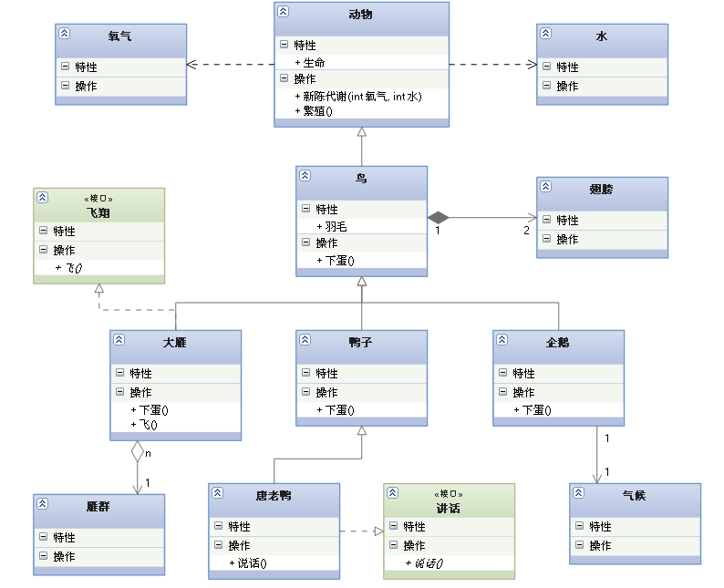

# 设计模式笔记

## UML类图

在UML类图中，常见的有以下几种关系：

- 泛化（Generalization），
- 实现（Realization），
- 组合  (Composition)，
- 聚合（Aggregation），
- 关联（Association)，
- 依赖  (Dependency)

#### 各种关系的强弱顺序

**泛化 = 实现 > 组合 > 聚合 > 关联 > 依赖**

#### 泛化（Generalization）

 

【箭头指向】：带三角箭头的实线，箭头指向父类

【泛化关系】：是一种继承关系，表示一般与特殊的关系，它指定了子类如何特化父类的所有特征和行为。 例如：老虎是动物的一种，即有老虎的特性也有动物的共性。

#### 实现（Realization）

【箭头指向】：带三角箭头的虚线，箭头指向接口

【实现关系】：是一种类与接口的关系，表示类是接口所有特征和行为的实现。

#### 组合(Composition)

【代码体现】：成员变量

【箭头及指向】：带实心菱形的实线，菱形指向整体

【组合关系】：是整体与部分的关系，但部分不能离开整体而单独存在。 如公司和部门是整体和部分的关系，没有公司就不存在部门。组合关系是关联关系的一种，是比聚合关系还要强的关系，它要求普通的聚合关系中代表整体的对象负责代表部分的对象的生命周期。

#### 聚合（Aggregation）

【代码体现】：成员变量

【箭头及指向】：带空心菱形的实心线，菱形指向整体

【聚合关系】：是整体与部分的关系，且部分可以离开整体而单独存在。 如车和轮胎是整体和部分的关系，轮胎离开车仍然可以存在。聚合关系是关联关系的一种，是强的关联关系；关联和聚合在语法上无法区分，必须考察具体的逻辑关系。

#### 关联（Association)

【代码体现】：成员变量

【箭头及指向】：带普通箭头的实心线，指向被拥有者

【关联关系】：是一种拥有的关系，它使一个类知道另一个类的属性和方法；如：老师与学生，丈夫与妻子。关联可以是双向的，也可以是单向的。双向的关联可以有两个箭头或者没有箭头，单向的关联有一个箭头。

下图中，老师与学生是双向关联，老师有多名学生，学生也可能有多名老师。但学生与某课程间的关系为单向关联，一名学生可能要上多门课程，课程是个抽象的东西他不拥有学生。

 

下图为自身关联：

#### 依赖(Dependency)

 

【代码表现】：局部变量、方法的参数或者对静态方法的调用

【箭头及指向】：带箭头的虚线，指向被使用者

【依赖关系】：是一种使用的关系， 即一个类的实现需要另一个类的协助，所以要尽量不使用双向的互相依赖。

下面这张UML图，比较形象地展示了各种类图关系：

## 面向对象设计原则

最常见的7种面向对象设计原则如下表所示：

| 设计原则名称                                        | 定 义                                            | 使用频率 |
| --------------------------------------------------- | ------------------------------------------------ | -------- |
| 单一职责原则 (Single Responsibility Principle, SRP) | 一个类只负责一个功能领域中的相应职责             | ★★★★☆    |
| 开闭原则 (Open-Closed Principle, OCP)               | 软件实体应对扩展开放，而对修改关闭               | ★★★★★    |
| 里氏代换原则 (Liskov Substitution Principle, LSP)   | 所有引用基类对象的地方能够透明地使用其子类的对象 | ★★★★★    |
| 依赖倒转原则 (Dependence Inversion Principle, DIP)  | 抽象不应该依赖于细节，细节应该依赖于抽象         | ★★★★★    |
| 接口隔离原则 (Interface Segregation Principle, ISP) | 使用多个专门的接口，而不使用单一的总接口         | ★★☆☆☆    |
| 合成复用原则 (Composite Reuse Principle, CRP)       | 尽量使用对象组合，而不是继承来达到复用的目的     | ★★★★☆    |
| 迪米特法则 (Law of Demeter, LoD)                    | 一个软件实体应当尽可能少地与其他实体发生相互作用 | ★★★☆☆    |

**单一职责原则**是最简单的面向对象设计原则，它用于控制类的粒度大小。单一职责原则定义如下：一个类只负责一个功能领域中的相应职责，或者可以定义为：就一个类而言，应该只有一个引起它变化的原因。单一职责原则告诉我们：一个类不能太“累”！在软件系统中，一个类（大到模块，小到方法）承担的职责越多，它被复用的可能性就越小，而且一个类承担的职责过多，就相当于将这些职责耦合在一起，当其中一个职责变化时，可能会影响其他职责的运作，因此要将这些职责进行分离，将不同的职责封装在不同的类中，即将不同的变化原因封装在不同的类中，如果多个职责总是同时发生改变则可将它们封装在同一类中。单一职责原则是实现高内聚、低耦合的指导方针，它是最简单但又最难运用的原则，需要设计人员发现类的不同职责并将其分离，而发现类的多重职责需要设计人员具有较强的分析设计能力和相关实践经验。

**开闭原则**是面向对象的可复用设计的第一块基石，它是最重要的面向对象设计原则。其定义如下：一个软件实体应当对扩展开放，对修改关闭。即软件实体应尽量在不修改原有代码的情况下进行扩展。软件实体可以指一个软件模块、一个由多个类组成的局部结构或一个独立的类。
任何软件都需要面临一个很重要的问题，即它们的需求会随时间的推移而发生变化。当软件系统需要面对新的需求时，我们应该尽量保证系统的设计框架是稳定的。如果一个软件设计符合开闭原则，那么可以非常方便地对系统进行扩展，而且在扩展时无须修改现有代码，使得软件系统在拥有适应性和灵活性的同时具备较好的稳定性和延续性。随着软件规模越来越大，软件寿命越来越长，软件维护成本越来越高，设计满足开闭原则的软件系统也变得越来越重要。
为了满足开闭原则，需要对系统进行抽象化设计，抽象化是开闭原则的关键。在Java、C#等编程语言中，可以为系统定义一个相对稳定的抽象层，而将不同的实现行为移至具体的实现层中完成。在很多面向对象编程语言中都提供了接口、抽象类等机制，可以通过它们定义系统的抽象层，再通过具体类来进行扩展。如果需要修改系统的行为，无须对抽象层进行任何改动，只需要增加新的具体类来实现新的业务功能即可，实现在不修改已有代码的基础上扩展系统的功能，达到开闭原则的要求。

**里氏代换原则**告诉我们，在软件中将一个基类对象替换成它的子类对象，程序将不会产生任何错误和异常，反过来则不成立。里氏代换原则是实现开闭原则的重要方式之一，由于使用基类对象的地方都可以使用子类对象，因此在程序中尽量使用基类类型来对对象进行定义，而在运行时再确定其子类类型，用子类对象来替换父类对象。

**依赖倒转原则**：抽象不应该依赖于细节，细节应当依赖于抽象。换言之，要针对接口编程，而不是针对实现编程。依赖倒转原则要求我们在程序代码中传递参数时或在关联关系中，尽量引用层次高的抽象层类，即使用接口和抽象类进行变量类型声明、参数类型声明、方法返回类型声明，以及数据类型的转换等，而不要用具体类来做这些事情。为了确保该原则的应用，一个具体类应当只实现接口或抽象类中声明过的方法，而不要给出多余的方法，否则将无法调用到在子类中增加的新方法。

在大多数情况下，开闭原则、里氏代换原则和依赖倒转原则这三个设计原则会同时出现，开闭原则是目标，里氏代换原则是基础，依赖倒转原则是手段，它们相辅相成，相互补充，目标一致，只是分析问题时所站角度不同而已。

**接口隔离原则**：使用多个专门的接口，而不使用单一的总接口，即客户端不应该依赖那些它不需要的接口。

**合成复用原则**：尽量使用对象组合，而不是继承来达到复用的目的。组合/聚合可以使系统更加灵活，降低类与类之间的耦合度，一个类的变化对其他类造成的影响相对较少；在使用继承时，需要严格遵循里氏代换原则，有效使用继承会有助于对问题的理解，降低复杂度，而滥用继承反而会增加系统构建和维护的难度以及系统的复杂度，因此需要慎重使用继承复用。
通过继承来进行复用的主要问题在于继承复用会破坏系统的封装性，因为继承会将基类的实现细节暴露给子类，由于基类的内部细节通常对子类来说是可见的，所以这种复用又称“白箱”复用，如果基类发生改变，那么子类的实现也不得不发生改变；从基类继承而来的实现是静态的，不可能在运行时发生改变，没有足够的灵活性；而且继承只能在有限的环境中使用（如类没有声明为不能被继承）。

由于组合或聚合关系可以将已有的对象（也可称为成员对象）纳入到新对象中，使之成为新对象的一部分，因此新对象可以调用已有对象的功能，这样做可以使得成员对象的内部实现细节对于新对象不可见，所以这种复用又称为“黑箱”复用，相对继承关系而言，其耦合度相对较低，成员对象的变化对新对象的影响不大，可以在新对象中根据实际需要有选择性地调用成员对象的操作；合成复用可以在运行时动态进行，新对象可以动态地引用与成员对象类型相同的其他对象。
一般而言，如果两个类之间是“Has-A”的关系应使用组合或聚合，如果是“Is-A”关系可使用继承。"Is-A"是严格的分类学意义上的定义，意思是一个类是另一个类的"一种"；而"Has-A"则不同，它表示某一个角色具有某一项责任。

**迪米特法则**可降低系统的耦合度，使类与类之间保持松散的耦合关系。

迪米特法则还有几种定义形式，包括：不要和“陌生人”说话、只与你的直接朋友通信等，在迪米特法则中，对于一个对象，其朋友包括以下几类：
(1) 当前对象本身(this)；
(2) 以参数形式传入到当前对象方法中的对象；
(3) 当前对象的成员对象；
(4) 如果当前对象的成员对象是一个集合，那么集合中的元素也都是朋友；
(5) 当前对象所创建的对象。
任何一个对象，如果满足上面的条件之一，就是当前对象的“朋友”，否则就是“陌生人”。在应用迪米特法则时，一个对象只能与直接朋友发生交互，不要与“陌生人”发生直接交互，这样做可以降低系统的耦合度，一个对象的改变不会给太多其他对象带来影响。
迪米特法则要求我们在设计系统时，应该尽量减少对象之间的交互，如果两个对象之间不必彼此直接通信，那么这两个对象就不应当发生任何直接的相互作用，如果其中的一个对象需要调用另一个对象的某一个方法的话，可以通过第三者转发这个调用。简言之，就是通过引入一个合理的第三者来降低现有对象之间的耦合度。

## 设计模式分类

| 分类           | 模式         | 举例                                     | 备注                           |
| -------------- | ------------ | ---------------------------------------- | ------------------------------ |
| 创建型模式6个  | 单例模式     |                                          | 确保对象的唯一性               |
|                | 原型模式     |                                          | 对象的克隆                     |
|                | 建造者模式   |                                          | 复杂对象的组装与创建           |
|                | 简单工厂模式 |                                          |                                |
|                | 工厂方法模式 |                                          |                                |
|                | 抽象工厂模式 |                                          |                                |
| 结构型模式7个  | 适配器模式   | InputStreamReader将InputStream适配Reader | 不兼容结构的协调               |
|                | 桥接模式     |                                          | 处理多维度变化                 |
|                | 装饰器模式   | BufferedInputStream                      | 扩展系统功能                   |
|                | 外观模式     |                                          |                                |
|                | 享元模式     | 包装类型缓存实例                         | 实现对象的复用                 |
|                | 代理模式     |                                          |                                |
| 行为型模式11个 | 职责链模式   |                                          | 请求的链式处理                 |
|                | 命令模式     |                                          | 请求发送者与接收者解耦         |
|                | 解释器模式   |                                          | 自定义语言的实现               |
|                | 迭代器模式   |                                          | 遍历聚合对象中的元素           |
|                | 中介者模式   |                                          | 协调多个对象之间的交互         |
|                | 备忘录模式   |                                          | 撤销功能的实现                 |
|                | 观察者模式   |                                          | 对象间的联动                   |
|                | 状态模式     |                                          | 处理对象的多种状态及其相互转换 |
|                | 策略模式     |                                          | 算法的封装与切换               |
|                | 模板方法模式 |                                          |                                |
|                | 访问者模式   |                                          | 操作复杂对象结构               |

## 设计模式区别

适配器模式与装饰器模式的区别？

## 创建型模式

### 简单工厂模式

**简单工厂模式**：定义一个工厂类，它可以根据参数的不同返回不同类的实例，被创建的实例通常都具有共同的父类。因为在简单工厂模式中用于创建实例的方法是静态方法，因此简单工厂模式又被称为**静态工厂方法模式**。

在简单工厂模式结构图中包含如下几个角色：

-  Factory（工厂角色）：工厂角色即工厂类，它是简单工厂模式的核心，负责实现创建所有产品实例的内部逻辑；工厂类可以被外界直接调用，创建所需的产品对象；在工厂类中提供了静态的工厂方法factoryMethod()，它的返回类型为抽象产品类型Product。
-  Product（抽象产品角色）：它是工厂类所创建的所有对象的父类，封装了各种产品对象的公有方法，它的引入将提高系统的灵活性，使得在工厂类中只需定义一个通用的工厂方法，因为所有创建的具体产品对象都是其子类对象。
-  ConcreteProduct（具体产品角色）：它是简单工厂模式的创建目标，所有被创建的对象都充当这个角色的某个具体类的实例。每一个具体产品角色都继承了抽象产品角色，需要实现在抽象产品中声明的抽象方法。

#### 简单工厂模式优点

- 工厂类是整个简单工厂模式的关键所在。它包含必要的判断逻辑，能够根据外界给定的信息（配置，或者参数），决定究竟应该创建哪个具体类的对象。用户在使用时可以直接根据工厂类去创建所需的实例，而无需了解这些对象是如何创建以及如何组织的。有利于整个软件体系结构的优化。
- 通过引入配置文件和反射，可以在不修改任何客户端代码的情况下更换和增加新的具体产品类，在一定程度上提高了系统的灵活性（如CarFactory2）。
- 客户端无须知道所创建的具体产品类的类名，只需要知道具体产品类所对应的参数即可，对于一些复杂的类名，通过简单工厂模式可以减少使用者的记忆量（如CarFactory3）。

#### 简单工厂模式缺点

- 由于工厂类集中了所有实例的创建逻辑，这就直接导致一旦这个工厂出了问题，所有的客户端都会受到牵连。
- 由于简单工厂模式的产品是基于一个共同的抽象类或者接口，这样一来，产品的种类增加的时候，即有不同的产品接口或者抽象类的时候，工厂类就需要判断何时创建何种接口的产品，这就和创建何种种类的产品相互混淆在了一起，违背了单一职责原则，导致系统丧失灵活性和可维护性。
- 正如上文提到的，一般情况下（如CarFactory1），简单工厂模式违背了“开放-关闭原则”，因为当我们新增加一个产品的时候必须修改工厂类，相应的工厂类就需要重新编译一遍。但这一点可以利用反射（CarFactory3在本质上也是利用反射）在一定程度上解决（如CarFactory2）。
- 使用反射可以使简单工厂在一定条件下满足“开放-关闭原则”，但这仅限于产品类的构造及初始化相同的场景。对于各产品实例化或者初始化不同的场景，很难利用反射满足“开放-关闭”原则。
- 简单工厂模式由于使用了静态工厂方法，造成工厂角色无法形成基于继承的等级结构。这一点笔者持保留态度，因为继承不是目的，如果没有这样的需求，这一点完全不算缺点，例如JDBC的DriverManager。

#### 已遵循的原则

- 依赖倒置原则
- 迪米特法则
- 里氏替换原则
- 接口隔离原则

#### 未遵循的原则

- 开闭原则（如上文所述，利用配置文件+反射或者注解可以避免这一点）
- 单一职责原则（工厂类即要负责逻辑判断又要负责实例创建）

### 工厂方法模式

简单工厂模式虽然简单，但存在一个很严重的问题。当系统中需要引入新产品时，由于静态工厂方法通过所传入参数的不同来创建不同的产品，这必定要修改工厂类的源代码，将违背“开闭原则”，如何实现增加新产品而不影响已有代码？工厂方法模式应运而生。

在工厂方法模式结构图中包含如下几个角色：

- Product（抽象产品）：它是定义产品的接口，是工厂方法模式所创建对象的超类型，也就是产品对象的公共父类。

- ConcreteProduct（具体产品）：它实现了抽象产品接口，某种类型的具体产品由专门的具体工厂创建，具体工厂和具体产品之间一一对应。

- Factory（抽象工厂）：在抽象工厂类中，声明了工厂方法(Factory Method)，用于返回一个产品。抽象工厂是工厂方法模式的核心，所有创建对象的工厂类都必须实现该接口。

- ConcreteFactory（具体工厂）：它是抽象工厂类的子类，实现了抽象工厂中定义的工厂方法，并可由客户端调用，返回一个具体产品类的实例。

#### 工厂方法模式优点

- 因为每个具体工厂类只负责创建产品，没有简单工厂中的逻辑判断，因此符合单一职责原则。
- 与简单工厂模式不同，工厂方法并不使用静态工厂方法，可以形成基于继承的等级结构。
- 新增一种产品时，只需要增加相应的具体产品类和相应的工厂子类即可，相比于简单工厂模式需要修改判断逻辑而言，工厂方法模式更符合开-闭原则。

#### 工厂方法模式缺点

- 添加新产品时，除了增加新产品类外，还要提供与之对应的具体工厂类，系统类的个数将成对增加，在一定程度上增加了系统的复杂度，有更多的类需要编译和运行，会给系统带来一些额外的开销。
- 虽然保证了工厂方法内的对修改关闭，但对于使用工厂方法的类，如果要换用另外一种产品，仍然需要修改实例化的具体工厂。
- 一个具体工厂只能创建一种具体产品

#### 已遵循的原则

- 依赖倒置原则
- 迪米特法则
- 里氏替换原则
- 接口隔离原则
- 单一职责原则（每个工厂只负责创建自己的具体产品，没有简单工厂中的逻辑判断）
- 开闭原则（增加新的产品，不像简单工厂那样需要修改已有的工厂，而只需增加相应的具体工厂类）

#### 未遵循的原则

- 开闭原则（虽然工厂对修改关闭了，但更换产品时，客户代码还是需要修改）

### 抽象工厂模式

抽象工厂模式定义如下：

抽象工厂模式(Abstract Factory Pattern)：提供一个创建一系列相关或相互依赖对象的接口，而无须指定它们具体的类。抽象工厂模式又称为Kit模式，它是一种对象创建型模式。

在抽象工厂模式中，每一个具体工厂都提供了多个工厂方法用于产生多种不同类型的产品，这些产品构成了一个产品族，抽象工厂模式结构如图5所示：

图5 抽象工厂模式结构图

在抽象工厂模式结构图中包含如下几个角色：

● AbstractFactory（抽象工厂）：它声明了一组用于创建一族产品的方法，每一个方法对应一种产品。

● ConcreteFactory（具体工厂）：它实现了在抽象工厂中声明的创建产品的方法，生成一组具体产品，这些产品构成了一个产品族，每一个产品都位于某个产品等级结构中。

● AbstractProduct（抽象产品）：它为每种产品声明接口，在抽象产品中声明了产品所具有的业务方法。

● ConcreteProduct（具体产品）：它定义具体工厂生产的具体产品对象，实现抽象产品接口中声明的业务方法。

#### 抽象工厂模式优点

- 因为每个具体工厂类只负责创建产品，没有简单工厂中的逻辑判断，因此符合单一职责原则。
- 与简单工厂模式不同，抽象工厂并不使用静态工厂方法，可以形成基于继承的等级结构。
- 新增一个产品族（如上文类图中的MySQLUserDao，MySQLRoleDao，MySQLProductDao）时，只需要增加相应的具体产品和对应的具体工厂类即可。相比于简单工厂模式需要修改判断逻辑而言，抽象工厂模式更符合开-闭原则。

#### 抽象工厂模式缺点

- 新增产品种类（如上文类图中的UserDao，RoleDao，ProductDao）时，需要修改工厂接口（或者抽象工厂）及所有具体工厂，此时不符合开-闭原则。抽象工厂模式对于新的产品族符合开-闭原则而对于新的产品种类不符合开-闭原则，这一特性也被称为开-闭原则的倾斜性。

#### 已遵循的原则

- 依赖倒置原则（工厂构建产品的方法均返回产品接口而非具体产品，从而使客户端依赖于产品抽象而非具体）
- 迪米特法则
- 里氏替换原则
- 接口隔离原则
- 单一职责原则（每个工厂只负责创建自己的具体产品族，没有简单工厂中的逻辑判断）
- 开闭原则（增加新的产品族，不像简单工厂那样需要修改已有的工厂，而只需增加相应的具体工厂类）

#### 未遵循的原则

- 开闭原则（虽然对新增产品族符合开-闭原则，但对新增产品种类不符合开-闭原则）

## 结构型模式

### 享元模式

享元模式（Flyweight Pattern）主要用于减少创建对象的数量，以减少内存占用和提高性能。这种类型的设计模式属于结构型模式，它提供了减少对象数量从而改善应用所需的对象结构的方式。享元模式尝试重用现有的同类对象，如果未找到匹配的对象，则创建新对象。

**意图：**运用共享技术有效地支持大量细粒度的对象。

**主要解决：**在有大量对象时，有可能会造成内存溢出，我们把其中共同的部分抽象出来，如果有相同的业务请求，直接返回在内存中已有的对象，避免重新创建。

**何时使用：** 1、系统中有大量对象。 2、这些对象消耗大量内存。 3、这些对象的状态大部分可以外部化。 4、这些对象可以按照内蕴状态分为很多组，当把外蕴对象从对象中剔除出来时，每一组对象都可以用一个对象来代替。 5、系统不依赖于这些对象身份，这些对象是不可分辨的。

**如何解决：**用唯一标识码判断，如果在内存中有，则返回这个唯一标识码所标识的对象。

**关键代码：**用 HashMap 存储这些对象。

**应用实例：** 1、JAVA 中的 String，如果有则返回，如果没有则创建一个字符串保存在字符串缓存池里面。 2、数据库的数据池。

**优点：**大大减少对象的创建，降低系统的内存，使效率提高。

**缺点：**提高了系统的复杂度，需要分离出外部状态和内部状态，而且外部状态具有固有化的性质，不应该随着内部状态的变化而变化，否则会造成系统的混乱。

**使用场景：** 1、系统有大量相似对象。 2、需要缓冲池的场景。

**注意事项：** 1、注意划分外部状态和内部状态，否则可能会引起线程安全问题。 2、这些类必须有一个工厂对象加以控制。

在享元模式结构图中包含如下几个角色：

- Flyweight（抽象享元类）：通常是一个接口或抽象类，在抽象享元类中声明了具体享元类公共的方法，这些方法可以向外界提供享元对象的内部数据（内部状态），同时也可以通过这些方法来设置外部数据（外部状态）。

- ConcreteFlyweight（具体享元类）：它实现了抽象享元类，其实例称为享元对象；在具体享元类中为内部状态提供了存储空间。通常我们可以结合单例模式来设计具体享元类，为每一个具体享元类提供唯一的享元对象。

- UnsharedConcreteFlyweight（非共享具体享元类）：并不是所有的抽象享元类的子类都需要被共享，不能被共享的子类可设计为非共享具体享元类；当需要一个非共享具体享元类的对象时可以直接通过实例化创建。

- FlyweightFactory（享元工厂类）：享元工厂类用于创建并管理享元对象，它针对抽象享元类编程，将各种类型的具体享元对象存储在一个享元池中，享元池一般设计为一个存储“键值对”的集合（也可以是其他类型的集合），可以结合工厂模式进行设计；当用户请求一个具体享元对象时，享元工厂提供一个存储在享元池中已创建的实例或者创建一个新的实例（如果不存在的话），返回新创建的实例并将其存储在享元池中。

在享元模式中引入了享元工厂类，享元工厂类的作用在于提供一个用于存储享元对象的享元池，当用户需要对象时，首先从享元池中获取，如果享元池中不存在，则创建一个新的享元对象返回给用户，并在享元池中保存该新增对象。

### 代理模式

代理模式包含如下三个角色：

- Subject（抽象主题角色）：它声明了真实主题和代理主题的共同接口，这样一来在任何使用真实主题的地方都可以使用代理主题，客户端通常需要针对抽象主题角色进行编程。

- Proxy（代理主题角色）：它包含了对真实主题的引用，从而可以在任何时候操作真实主题对象；在代理主题角色中提供一个与真实主题角色相同的接口，以便在任何时候都可以替代真实主题；代理主题角色还可以控制对真实主题的使用，负责在需要的时候创建和删除真实主题对象，并对真实主题对象的使用加以约束。通常，在代理主题角色中，客户端在调用所引用的真实主题操作之前或之后还需要执行其他操作，而不仅仅是单纯调用真实主题对象中的操作。

- RealSubject（真实主题角色）：它定义了代理角色所代表的真实对象，在真实主题角色中实现了真实的业务操作，客户端可以通过代理主题角色间接调用真实主题角色中定义的操作。

代理模式根据其目的和实现方式不同可分为很多种类，其中常用的几种代理模式简要说明如下：

- 远程代理(Remote Proxy)：为一个位于不同的地址空间的对象提供一个本地的代理对象，这个不同的地址空间可以是在同一台主机中，也可是在另一台主机中，远程代理又称为大使(Ambassador)。

- 虚拟代理(Virtual Proxy)：如果需要创建一个资源消耗较大的对象，先创建一个消耗相对较小的对象来表示，真实对象只在需要时才会被真正创建。

- 保护代理(Protect Proxy)：控制对一个对象的访问，可以给不同的用户提供不同级别的使用权限。

- 缓冲代理(Cache Proxy)：为某一个目标操作的结果提供临时的存储空间，以便多个客户端可以共享这些结果。

- 智能引用代理(Smart Reference Proxy)：当一个对象被引用时，提供一些额外的操作，例如将对象被调用的次数记录下来等。

**代理模式 vs. 装饰模式**

调用方直接调用代理而不需要直接操作被代理对象甚至都不需要知道被代理对象的存在。同时，代理类可代理的具体被代理类是确定的，如本例中ProxySubject只可代理ConcreteSubject。

装饰类可装饰的类并不固定，并且被装饰对象是在使用时通过组合确定。如本例中SubjectPreDecorator装饰ConcreteSubject，而SubjectPostDecorator装饰SubjectPreDecorator。并且被装饰对象由调用方实例化后通过构造方法（或者setter）指定。

装饰模式的本质是**动态组合**。动态是手段，组合是目的。每个装饰类可以只负责添加一项额外功能，然后通过组合为被装饰类添加复杂功能。由于每个装饰类的职责比较简单单一，增加了这些装饰类的可重用性，同时也更符合单一职责原则。

总结

- 从语意上讲，代理模式是为控制对被代理对象的访问，而装饰模式是为了增加被装饰对象的功能
- 代理类所能代理的类完全由代理类确定，装饰类装饰的对象需要根据实际使用时客户端的组合来确定
- 被代理对象由代理对象创建，客户端甚至不需要知道被代理类的存在；被装饰对象由客户端创建并传给装饰对象

**Java三种代理模式：静态代理、动态代理和cglib代理**

静态代理：

- 要代理对象和目标对象实现一样的接口。
- 优点：可以在不修改目标对象的前提下扩展目标对象的功能。
- 缺点：
  1. 冗余。由于代理对象要实现与目标对象一致的接口，会产生过多的代理类。
  2. 不易维护。一旦接口增加方法，目标对象与代理对象都要进行修改。

动态代理：

- 动态代理利用了JDK API，动态代理又被称为JDK代理或接口代理。
- 动态代理对象不需要实现接口，但是要求目标对象必须实现接口，否则不能使用动态代理。

静态代理与动态代理的区别主要在：

- 静态代理在编译时就已经实现，编译完成后代理类是一个实际的class文件
- 动态代理是在运行时动态生成的，即编译完成后没有实际的class文件，而是在运行时动态生成类字节码，并加载到JVM中

cglib代理：

cglib与动态代理最大的区别就是：

- 使用动态代理的对象必须实现一个或多个接口
- 使用cglib代理的对象则无需实现接口，达到代理类无侵入。

### 适配器模式

适配器模式（Adapter Pattern），将一个类的接口转换成客户希望的另外一个接口。适配器模式使得原本由于接口不兼容而不能一起工作的那些类可以一起工作。

适配器模式类图如下

在对象适配器模式结构图中包含如下几个角色：

● Target（目标抽象类）：目标抽象类定义客户所需接口，可以是一个抽象类或接口，也可以是具体类。

● Adapter（适配器类）：适配器可以调用另一个接口，作为一个转换器，对Adaptee和Target进行适配，适配器类是适配器模式的核心，在对象适配器中，它通过继承Target并关联一个Adaptee对象使二者产生联系。

● Adaptee（适配者类）：适配者即被适配的角色，它定义了一个已经存在的接口，这个接口需要适配，适配者类一般是一个具体类，包含了客户希望使用的业务方法，在某些情况下可能没有适配者类的源代码。

根据对象适配器模式结构图，在对象适配器中，客户端需要调用request()方法，而适配者类Adaptee没有该方法，但是它所提供的specificRequest()方法却是客户端所需要的。为了使客户端能够使用适配者类，需要提供一个包装类Adapter，即适配器类。这个包装类包装了一个适配者的实例，从而将客户端与适配者衔接起来，在适配器的request()方法中调用适配者的specificRequest()方法。因为适配器类与适配者类是关联关系（也可称之为委派关系），所以这种适配器模式称为对象适配器模式。

#### 适配器模式优点

- 客户端可以以统一的方式使用ConcreteTarget和Adaptee
- 适配器负责适配过程，而不需要修改待适配类，其它直接依赖于待适配类的调用方不受适配过程的影响
- 可以为不同的目标接口实现不同的适配器，而不需要修改待适配类，符合开放-关闭原则

#### 已遵循的原则

- 依赖倒置原则
- 迪米特法则
- 里氏替换原则
- 接口隔离原则
- 单一职责原则
- 开闭原则

#### 未遵循的原则

- NA

### 桥接模式

#### 类图

桥接模式类图如下

从上图可知，当把每个维度拆分开来，只需要M*N个类，并且由于每个维度独立变化，基本不会出现重复代码。

此时如果增加手自一体档，只需要增加一个AMT类即可。

#### 已遵循的原则

- 依赖倒置原则
- 迪米特法则
- 里氏替换原则
- 接口隔离原则
- 单一职责原则
- 开闭原则

#### 未遵循的原则

- NA

### 组合模式

#### 类图

#### 角色划分

- 抽象组件，如上图中的Component
- 简单组件，如上图中的SimpleComponent
- 复合组件，如上图中的CompositeComponent

#### 组合模式优点

- 高层模块调用简单。组合模式中，用户不用关心到底是处理简单组件还是复合组件，可以按照统一的接口处理。不必判断组件类型，更不用为不同类型组件分开处理。
- 组合模式可以很容易的增加新的组件。若要增加一个简单组件或复合组件，只须找到它的父节点即可，非常容易扩展，符合“开放-关闭”原则。

组合模式缺点

- 无法限制组合组件中的子组件类型。在需要检测组件类型时，不能依靠编译期的类型约束来实现，必须在运行期间动态检测。

#### 已遵循的原则

- 依赖倒置原则（复合类型不依赖于任何具体的组件而依赖于抽象组件）
- 迪米特法则
- 里氏替换原则
- 接口隔离原则
- 单一职责原则
- 开闭原则

#### 未遵循的原则

- NA

### 装饰模式

装饰模式定义如下：

装饰模式(Decorator Pattern)：动态地给一个对象增加一些额外的职责，就增加对象功能来说，装饰模式比生成子类实现更为灵活。装饰模式是一种对象结构型模式。

装饰模式类图如下

在装饰模式结构图中包含如下几个角色：

● Component（抽象构件）：它是具体构件和抽象装饰类的共同父类，声明了在具体构件中实现的业务方法，它的引入可以使客户端以一致的方式处理未被装饰的对象以及装饰之后的对象，实现客户端的透明操作。

● ConcreteComponent（具体构件）：它是抽象构件类的子类，用于定义具体的构件对象，实现了在抽象构件中声明的方法，装饰器可以给它增加额外的职责（方法）。

● Decorator（抽象装饰类）：它也是抽象构件类的子类，用于给具体构件增加职责，但是具体职责在其子类中实现。它维护一个指向抽象构件对象的引用，通过该引用可以调用装饰之前构件对象的方法，并通过其子类扩展该方法，以达到装饰的目的。

● ConcreteDecorator（具体装饰类）：它是抽象装饰类的子类，负责向构件添加新的职责。每一个具体装饰类都定义了一些新的行为，它可以调用在抽象装饰类中定义的方法，并可以增加新的方法用以扩充对象的行为。

### 外观模式

外观模式又称为门面模式，它是一种对象结构型模式。外观模式是迪米特法则的一种具体实现，通过引入一个新的外观角色可以降低原有系统的复杂度，同时降低客户类与子系统的耦合度。

外观模式包含如下两个角色：

(1) Facade（外观角色）：在客户端可以调用它的方法，在外观角色中可以知道相关的（一个或者多个）子系统的功能和责任；在正常情况下，它将所有从客户端发来的请求委派到相应的子系统去，传递给相应的子系统对象处理。

(2) SubSystem（子系统角色）：在软件系统中可以有一个或者多个子系统角色，每一个子系统可以不是一个单独的类，而是一个类的集合，它实现子系统的功能；每一个子系统都可以被客户端直接调用，或者被外观角色调用，它处理由外观类传过来的请求；子系统并不知道外观的存在，对于子系统而言，外观角色仅仅是另外一个客户端而已。

=================
代理模式与委托模式的异同点
