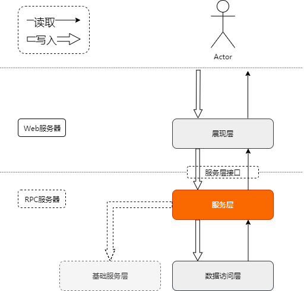

# 互联网公司三层架构总结

> 发布日期：2020-01-14

从毕业开始我就被告知项目中要采用分层的架构模式，那时候只是亦步亦趋还不能领悟个中道理。最近开始关注架构方面的问题，慢慢有了一些思考和体会，便想将项目里的架构模式总结一下。笔者工作资历不算丰富，所以讲的仅仅是一家之言，供参考。

我的理解是架构这个东西无分对错，更像是在可维护性，易操作性之间取得的一种平衡：项目很小，可能没必要明确地划分架构；随着项目规模变大，项目的调用关系自然而然地变得更加复杂，规则约束也变得越来越多。这时伴随着团队成员的扩张，如果在架构上不加任何控制，无论是代码的可读性，可复用性都会变差，改动代码的影响范围以及代价都难以评估，最终项目会变得难以维护。

### 为什么要分层

根据软件行业的经验，分层架构是最常见的也是十分有效的解决复杂问题的架构模式。

**分层的本质是关注点分离**。人的精力可能只适合于单线程的活动，并不适合同时关注多个细节。通过分层能够清晰地展现程序的处理脉络，更容易集中注意力去解决每一个环节的核心问题。

**分层也是应用程序从“接收请求”到“处理业务逻辑”到“持久化”这一过程的自然贴合**。“接收请求”和“返回结果”这部分代码很自然地表现为展现层，程序状态的“持久化”很自然地体现为数据访问层，业务逻辑的“处理过程”很自然地体现为服务层。

**分层也是从“易于机器阅读”向“易于人类阅读”的理念性转变**。写代码很容易，写正确的代码往往就很难了，写出正确且易于理解的代码就更难了。很多人可能会有这样的体会，查看遗留项目或者别人写的代码时候，心里不免默默地说一句“我*，这TM是给人看的！”。只有怀着敬畏之心去写每一行代码，只有像写诗一样去写每一行代码，才能真正写出优秀的代码。

### 如何分层

**展现层**通常对外提供Http服务，不论读请求还是写请求都是向下调用服务层进行处理。

**服务层（或者称为业务逻辑层）**的职责用行业黑话讲叫处理业务逻辑，对于写请求来说就是更改内部状态并通过数据访问层进行持久化。展现层和服务层通过**服务层接口**进行解耦。应用程序往往不是孤立的，会调用其他第三方的服务比如用户服务、报警、发邮件等待，做得清晰一点的话会将调用其他服务的代码独立出来成为**基础服务层**，或者就跟服务层融合。

**数据访问层**主要负责保存程序内部状态，以保证程序宕机或重启之后能够恢复，通常是持久化到MySQL等数据库中。

需要注意的是展现层不能直接调用数据访问层，每一层只能和直接的下层进行交互，下层不能调用上层，这样才能保证分层的意义。

规模稍微大一点的项目通常都会部署为一套Web服务，一套RPC服务，为什么要独立出RPC服务呢？一个服务可能有被多个不同应用调用的需求，RPC服务无论从调用方还是服务方都比Http服务更简洁更高效。

以上是从纵向角度考虑的分层，从横向角度来讲，服务层内部各个服务之间也是要有分层的，暂且称之为“业务服务分组”。实践过程中很多项目往往不考虑横向的分组，在服务层内部往往关联性不同的业务服务都杂糅在一起，违背了高内聚低耦合的原则。这种情况可能不是有意为之的，而是随着项目规模的扩张没有及时纠正导致的。

### 总结

按照三层架构写一个项目很容易，但是开发人员很容易形成烟囱式的、一竿子到底的开发方式，导致代码的可复用性很低；同时项目中很容易充斥着各种失血模型，造成用着面向对象语言却处处写的是过程式代码的窘境。因此可以看出领域驱动设计（DDD）里把领域模型层独立出来确实是很有必要的事。

### 参考

- [架构漫谈系列(1) 关注点分离](https://www.cnblogs.com/asis/p/architecture-Soc.html)