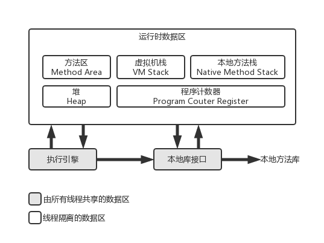

# java运行时数据区

主要包括：堆内存、方法区（包括运行时常量池）、栈内存（包括虚拟机栈和本地方法栈）、程序计数器。

从共享范围上来划分可分为两类：线程共享区域（堆和方法区）；线程私有区域（虚拟机栈、本地方法栈和程序计数器）。

从堆概念来划分可分为两类：堆内存和非堆内存。

### 1. 划分

#### 1. 1程序计数器

在任何一个确定的时刻，一个处理器只会执行一条线程中的指令，因此每条线程都需要一个独立的程序计数器，各条线程之间计数器互不影响，我们称这类内存区域为“线程私有”的内存。

如果线程正在执行的是一个java方法，这个计数器记录的是正在执行的虚拟机字节码指令的地址；如果正在执行的是native方法，这个计数器值为空。

#### 1.2 java虚拟机栈

线程私有，生命周期与线程相同。每个方法在执行时都会创建一个栈帧（stack frame）用于存储局部变量表、操作数栈、动态连接、方法出口等信息。

**局部变量表**存放了编译期可知的各种基本类型、对象引用和returnAddress类型。局部变量表所需内存空间在编译期分配，在运行期不会改变大小。

#### 1.3 java堆

所有线程共享。所有的对象实例以及数组都在堆上分配。

#### 1.4 方法区

所有线程共享，用于存储已被虚拟机加载的类信息、常量、静态变量、jit编译后的代码等数据，也称**非堆**。

java7之前，方法区位于永久代(PermGen)，永久代和堆相互隔离，永久代的大小在启动JVM时可以设置一个固定值，不可变； 
java7中，存储在永久代的部分数据就已经转移到Java Heap或者Native memory。但永久代仍存在于JDK 1.7中，并没有完全移除，譬如符号引用(Symbols)转移到了native memory；字符串常量池(interned strings)转移到了Java heap；类的静态变量(class statics)转移到了Java heap。 
java8中，取消永久代，方法存放于元空间(Metaspace)，元空间仍然与堆不相连，但与堆共享物理内存，逻辑上可认为在堆中 。

**运行时常量池** 是方法区的一部分，用于存放编译期生成的各种字面量和符号引用。运行时常量池相对于class文件常量池的另外一个重要特征是具备动态性，运行期间也可能将新的常量放入池中（String.intern()）

#### 1.5 直接内存

并不是运行时数据区的一部分，不受java堆大小限制，受本机内存大小和cpu寻址空间限制。

### 2. 各区域对比

| 区域         | 是否共享 | 功能                                                         | 可能抛出的错误                                               |
| ------------ | -------- | ------------------------------------------------------------ | ------------------------------------------------------------ |
| java堆       | 是       | 所有的对象实例以及数组都在堆上分配                           | 没有内存完成实例分配，并且无法扩展时抛出OutOfMemoryError     |
| 方法区       | 是       | 用于存储已被虚拟机加载的类信息、常量、静态变量、jit编译后的代码等数据 | OutOfMemoryError                                             |
| 程序计数器   | 否       | 存储指令地址                                                 | 无                                                           |
| java虚拟机栈 | 否       | 存储局部变量表、操作数栈、动态连接、方法出口等信息           | 栈深度大于虚拟机允许的深度抛出StackOverflowError; 动态扩展无法申请到足够内存抛出OutOfMemoryError |
| 本地方法栈   | 否       | 为native方法服务                                             | StackOverflowError; OutOfMemoryError                         |
| **直接内存** | /        |                                                              | OutOfMemoryError                                             |

除了java堆和永久代之外，下面的这些区域还会占用较多的内存：

1. direct memory: 可以通过-XX: MaxDirectMemorySize调整大小
2. 线程堆栈：-Xss调整,内存不足时抛出StackOverflowError(无法分配新的栈帧)，或者OutOfMemoryError:unable to create new native thread(无法建立新的线程)
3. Socket缓冲区：每个socket连接都有Receive和Send两个缓冲区，如果无法分配会抛出IOException:Too many open files
4. JNI代码
5. 虚拟机和GC：也要消耗一定的内存

## 对象的创建

new指令流程：

1. 检查能否在常量池中定位到一个类的符号引用，并且检查所代表的类是否已被加载、解析和初始化过，如果没有则先执行相应的类加载过程。
2. 为对象分配内存，根据java堆是否规整而决定分配方式：
   - 在使用serial、ParNew等带compact过程的收集器时系统采用指针碰撞的方式；
   - 在使用CMS这种基于Mark-Sweep算法的收集器时采用空闲列表。
3. 将分配的内存空间初始化为零值
4. 设置对象头
5. 执行`<init>`方法

## 引用

在JDK 1.2之后，Java对引用的概念进行了扩充，将引用分为强引用（Strong Reference)、软引用（Soft Reference)、弱引用（Weak Reference)、虚引用（Phantom Reference)4种，这4种引用强度依次逐渐减弱。

- **强引用** 就是指在程序代码之中普遍存在的，类似“Objectobj = new Object()”这类的引用，只要强引用还存在，垃圾收集器永远不会回收掉被引用的对象。
- **软引用** 是用来描述一些还有用但并非必需的对象。对于软引用关联着的对象，在系统将要发生内存溢出异常之前，将会把这些对象列进回收范围之中进行第二次回收。如果这次回收还没有足够的内存，才会抛出内存溢出异常。在JDK1.2之后，提供了Soft Reference类来实现软引用。
- **弱引用** 也是用来描述非必需对象的，但是它的强度比软引用更弱一些，被弱引用关联的对象只能生存到下一次垃圾收集发生之前。当垃圾收集器工作时，无论当前内存是否足够，都会回收掉只被弱引用关联的对象。在JDK1.2之后，提供广Weak Reference类来实现弱引用。

- **虚引用** 也称为幽灵引用或者幻影引用，它是最弱的一种引用关系。一个对象是否有虚引用的存在，完全不会对其生存时间构成影响，也无法通过虚引用来取得一个对象实例。为一个对象设置虚引用关联的唯一目的就是能在这个对象被收集器回收时收到一个系统通知。在JDK1.2之后，提供了Phantom Reference类来实现虚引用。

## 参考

[【JVM】JVM内存模型（JVMMM）](https://www.huaweicloud.com/zhishi/arc-12588701.html)
