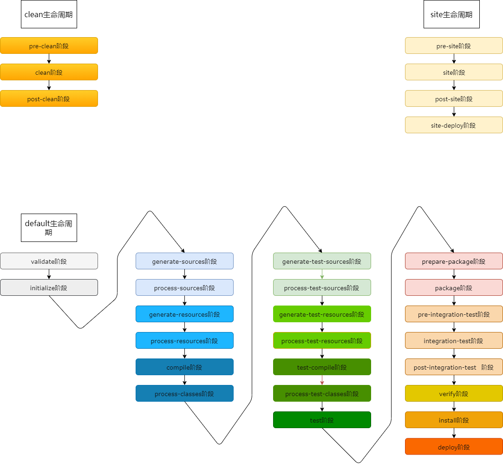

# Apache Maven分享

## 构建工具的沿革

#### GNU Make

创建于1976年，是最常用的构建工具。

#### Apache Ant

创建于2000年，起源于Tomcat，基于构建文件执行一系列步骤的Java库和命令行工具，主要用于构建Java应用程序。

参考示例：https://en.wikipedia.org/wiki/Apache_Ant#Example。

#### Apache Maven

创建于2002年，基于Java平台的依赖管理、项目构建和项目信息管理工具。

> 最初是为了简化 Jakarta Turbine 项目中的构建过程。有几个项目，每个项目都有自己的 Ant 构建文件，它们都略有不同。JAR 被检入 CVS。我们想要一种标准的方式来构建项目，清楚地定义项目的组成，发布项目信息的简单方法，以及在多个项目之间共享 JAR 的方法。

#### Apache Ivy

创建于2004年，作为Ant的依赖管理工具，是Ant的子项目。默认使用 Maven 2 中央仓库。

参考示例：https://ant.apache.org/ivy/history/2.5.0/tutorial/start.html。

#### Gradle

创建于2008年，Gradle是依赖关系管理和构建自动化工具，结合了Ant的灵活性和Maven的约定优于配置的优点。

| 构建工具              | 模型                                  | 配置文件格式 | 特点                       |
| --------------------- | ------------------------------------- | ------------ | -------------------------- |
| GNU Make              | Rule（target, prerequisite, command） | Makefile     | 灵活                       |
| Apache Ant+Apache Ivy | target, depends, task                 | XML          | 跨平台，灵活               |
| Apache Maven          | Project Object Model                  | XML          | 跨平台，约定优于配置       |
| Gradle                | DAG Tasks                             | Groovy DSL   | 跨平台，灵活，约定优于配置 |

## 简介

Maven不仅是构建工具，还是依赖管理工具，项目信息管理工具。

Maven抽象了一个完整的构建生命周期模型，这个模型吸取了大量其他的构建脚本和构建工具的优点，总结了大量项目的实际需求。

## 依赖

### 坐标

用来唯一标识一个构件，坐标五要素：groupId，artifactId，version，packaging，classifier。

观察 https://repo1.maven.org/maven2/com/alibaba/fastjson/1.2.80/：

```xml
<?xml version="1.0" encoding="UTF-8"?>
<project xmlns="http://maven.apache.org/POM/4.0.0" xmlns:xsi="http://www.w3.org/2001/XMLSchema-instance"
         xsi:schemaLocation="http://maven.apache.org/POM/4.0.0 http://maven.apache.org/xsd/maven-4.0.0.xsd">
    <modelVersion>4.0.0</modelVersion>
    <groupId>com.alibaba</groupId>
    <artifactId>fastjson</artifactId>
    <version>1.2.80</version>
 
    <packaging>jar</packaging>
    <name>fastjson</name>
    <description>Fastjson is a JSON processor (JSON parser + JSON generator) written in Java</description>
 
    <url>https://github.com/alibaba/fastjson</url>
    <inceptionYear>2012</inceptionYear>
</project>
```

构件的文件名与坐标对应规则：`artifactId-version[-classifier].packaging`。

| 元素       | 说明                                                     |
| ---------- | -------------------------------------------------------- |
| groupId    | 定义隶属的项目                                           |
| artifactId | 定义一个项目模块                                         |
| version    | 版本号                                                   |
| packaging  | 打包方式，如jar, war, pom, maven-plugin...默认为jar      |
| classifier | 插件生成，不能直接定义，如：source, javadoc, test-jar... |

classifier示例：

```xml
<project>
    <build>
        <plugins>
            <plugin>
                <groupId>org.apache.maven.plugins</groupId>
                <artifactId>maven-source-plugin</artifactId>
                <version>2.1.2</version>
                <executions>
                    <execution>
                        <id>attach-sources</id>
                        <phase>verify</phase>
                        <goals>
                            <goal>jar-no-fork</goal>
                        </goals>
                    </execution>
                </executions>
            </plugin>
            <plugin>
                <groupId>org.apache.maven.plugins</groupId>
                <artifactId>maven-javadoc-plugin</artifactId>
                <version>2.7</version>
                <executions>
                    <execution>
                        <id>attach-javadocs</id>
                        <goals>
                            <goal>jar</goal>
                        </goals>
                    </execution>
                </executions>
            </plugin>
        </plugins>
    </build>
</project>
```

### 依赖配置

| 元素       | 对应坐标               | 说明                           |
| ---------- | ---------------------- | ------------------------------ |
| groupId    | groupId                |                                |
| artifactId | artifactId，classifier |                                |
| version    | version                |                                |
| type       | packaging              |                                |
| scope      | -                      | 依赖范围                       |
| optional   | -                      | 支持互斥的依赖，建议分模块替代 |
| exclusions | -                      | 排除依赖                       |

### 依赖范围

|          | 编译classpath | 测试classpath | 运行时classpath |
| -------- | ------------- | ------------- | --------------- |
| compile  | ✔️             | ✔️             | ✔️               |
| provided | ✔️             | ✔️             |                 |
| system   | ✔️             | ✔️             |                 |
| runtime  |               | ✔️             | ✔️               |
| test     |               | ✔️             |                 |
| import   |               |               |                 |

示例：

```xml
<project>
     <dependencyManagement>
        <dependencies>
            <dependency>
                <groupId>org.springframework.boot</groupId>
                <artifactId>spring-boot-dependencies</artifactId>
                <version>2.5.0</version>
                <type>pom</type>
                <scope>import</scope>
            </dependency>
        </dependencies>
    </dependencyManagement>
    <dependencies>
        <dependency>
            <groupId>com.sensorsdata.graph</groupId>
            <artifactId>graph-analysis</artifactId>
            <version>1.0</version>
            <scope>system</scope>
            <systemPath>${project.basedir}/lib/graph-analysis-1.0.jar</systemPath>
        </dependency>
        <dependency>
            <groupId>commons-dbcp</groupId>
            <artifactId>commons-dbcp</artifactId>
            <version>1.4</version>
            <scope>runtime</scope>
        </dependency>
        <dependency>
            <groupId>junit</groupId>
            <artifactId>junit</artifactId>
            <version>4.12</version>
            <scope>test</scope>
        </dependency>
    </dependencies>
</project>
```

import：将SpringBoot的依赖模板引入，省去了自己定义[SpringBoot依赖模板](https://repo1.maven.org/maven2/org/springframework/boot/spring-boot-dependencies/2.5.0/spring-boot-dependencies-2.5.0.pom)。

### 依赖传递

| 第一依赖\第二依赖 | Compile  | test | Provided | Runtime  |
| ----------------- | -------- | ---- | -------- | -------- |
| Compile           | Compile  | -    | -        | Runtime  |
| Test              | Test     | -    | -        | Test     |
| Provided          | Provided | -    | Provided | Provided |
| Runtime           | Runtime  | -    | -        | Runtime  |

### 依赖调解

两个原则：

- 路径近者优先
- 第一声明者优先

```
# Idea插件：maven-helper
mvn dependency:list
mvn dependency:tree
```

### 最佳实践

排除依赖：

```xml
<dependency>
    <groupId>com.sensorsdata.framework</groupId>
    <artifactId>garden-api</artifactId>
    <exclusions>
        <exclusion>
            <artifactId>jackson-databind</artifactId>
            <groupId>com.fasterxml.jackson.core</groupId>
        </exclusion>
    </exclusions>
</dependency>
```

使用dependencyManagement和pluginManagement：https://github.com/apache/kylin/blob/kylin-2.3.0/pom.xml。

不合理依赖分析：

```
# mvn dependency:analyze
Used undeclared dependencies found:
   org.apache.commons:commons-lang3:jar:3.4:compile
   com.sensorsdata.framework:garden-common:jar:1.6.4:compile
Unused declared dependencies found:
   org.apache.commons:commons-compress:jar:1.18:compile
   com.spotify:docker-client:jar:shaded:8.14.4:test
```

## 仓库

### 本地仓库

默认位于~/.m2/repository。一个构件只有存在在本地仓库，才能被其他Maven项目引用。来源：从远程仓库下载，或者将本地构建安装到本地仓库。

### 远程仓库

中央仓库：默认的远程仓库，地址为：https://repo.maven.apache.org/maven2。

配置方式：

https://maven.apache.org/settings.html#repositories。

[Maven Pom / settings 配置规范](https://doc.sensorsdata.cn/pages/viewpage.action?pageId=203395747)

### 从仓库解析依赖的机制

1. system依赖范围从本地文件系统解析。
2. 如果是RELEASE，LATEST和SNAPSHOT版本，则基于更新策略读取所有远程仓库的元数据，将其与本地仓库的对应元数据合并后，得到最新快照版本的值。
3. 如果是正式版本，如果本地存在，则解析成功，否则遍历所有远程仓库，发现后，下载并解析使用。

命令行可以更改默认行为：-o，-U参数。

### 镜像

通过settings.xml配置：https://maven.apache.org/guides/mini/guide-mirror-settings.html

```
<settings>
  ...
  <mirrors>
    <mirror>
      <id>other-mirror</id>
      <name>Other Mirror Repository</name>
      <url>https://other-mirror.repo.other-company.com/maven2</url>
      <mirrorOf>central</mirrorOf>
    </mirror>
  </mirrors>
  ...
</settings>
```

mirrorOf取值：

| mirrorOf   |                               |
| :--------- | :---------------------------- |
| *          | 所有                          |
| external:* | 除了localhost和基于file的仓库 |
| repo,repo1 | 包括repo, repo1               |
| *,!repo1   | 所有，除了repo1               |

## 生命周期

maven中定义了3套相互独立的生命周期（lifecycle）：

1. clean生命周期
2. default生命周期
3. site生命周期

每套生命周期中有多个阶段（phase），每套中的多个阶段是有先后顺序的，并且后面的阶段依赖于前面的阶段：



`mvn`命令通过调用这些阶段去完成项目生命周期中具体的操作：

```
mvn <phase1> <phase2> <phase3>...
```

执行某个阶段的时候，会按序先执行其前面所有的阶段。

## 插件目标

插件中的每个功能就叫做插件的目标（goal），每个插件中可能包含一个或者多个插件目标：

```
mvn dependency:tree
mvn dependency:list
```

maven只是定义了生命周期中的阶段，而每个阶段中具体实现是由插件的目标来完成的。

所以需要将阶段和插件目标进行绑定，来让插件目标帮助生命周期的阶段做具体的工作。

生命周期中的每个阶段支持绑定多个插件的多个目标。

maven已经内置了一些插件以及绑定：


## 聚合和继承

### 聚合

多模块项目

### 继承

父子项目

super POM：https://github.com/apache/maven/blob/maven-3.6.3/maven-model-builder/src/main/resources/org/apache/maven/model/pom-4.0.0.xml

### 反应堆（reactor）

在多模块项目中，所有模块组成的一个构建结构，模块之间的依赖关系将反应堆构成一个DAG图。

裁剪反应堆：

```shell
# 演示
mvn -pl
mvn -am
mvn -amd
mvn -rf
```

## 多环境

### Maven属性

| 分类         | 说明                                              |
| :----------- | :------------------------------------------------ |
| 内置属性     | ${basedir}项目根目录${version}项目版本号          |
| POM属性      | POM文件中对应元素的值，如${project.artifactId}    |
| 自定义属性   | POM \<properties>元素下定义                       |
| Settings属性 | 引用Settings.xml文件中XML元素的值                 |
| Java系统属性 | JVM启动的时候通过-D参数传入的属性，如${user.home} |
| 环境变量属性 | 如${env.JAVA_HOME}                                |

### Profile

激活方式：

1. 命令行激活：-P 

   ```
   mvn groupId:artifactId:goal -P profile-1,profile-2,?profile-3
   ```

2. settings.xml激活 

   ```
   <settings>
     ...
     <activeProfiles>
       <activeProfile>profile-1</activeProfile>
     </activeProfiles>
     ...
   </settings>
   ```

3. JDK版本激活 

   ```
   <profiles>
     <profile>
       <activation>
         <jdk>1.4</jdk>
       </activation>
       ...
     </profile>
   </profiles>
   ```

4. 系统属性激活 

   ```
   <profiles>
     <profile>
       <activation>
         <property>
           <name>debug</name>
         </property>
       </activation>
       ...
     </profile>
   </profiles>
   ```

5. 操作系统激活 

   ```
   <profiles>
     <profile>
       <activation>
         <os>
           <name>Windows XP</name>
           <family>Windows</family>
           <arch>x86</arch>
           <version>5.1.2600</version>
         </os>
       </activation>
       ...
     </profile>
   </profiles>
   ```

6. 文件存在激活 

   ```
   <profiles>
     <profile>
       <activation>
         <file>
           <missing>target/generated-sources/axistools/wsdl2java/org/apache/maven</missing>
         </file>
       </activation>
       ...
     </profile>
   </profiles>
   ```

7. 默认激活 

   ```
   <profiles>
     <profile>
       <id>profile-1</id>
       <activation>
         <activeByDefault>true</activeByDefault>
       </activation>
       ...
     </profile>
   </profiles>
   ```

## 参考

《Maven实战》