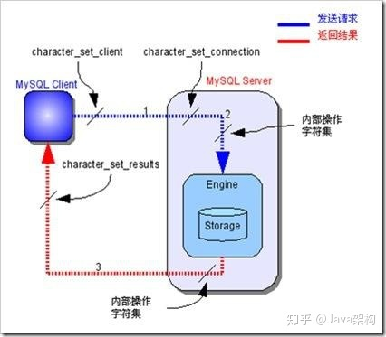

# MySQL笔记

## 数据类型

### 日期时间类型

日期和时间类型包括 [`DATE`](https://dev.mysql.com/doc/refman/5.7/en/datetime.html), [`TIME`](https://dev.mysql.com/doc/refman/5.7/en/time.html), [`DATETIME`](https://dev.mysql.com/doc/refman/5.7/en/datetime.html), [`TIMESTAMP`](https://dev.mysql.com/doc/refman/5.7/en/datetime.html), 以及 [`YEAR`](https://dev.mysql.com/doc/refman/5.7/en/year.html)，每种类型都有一系列有效值，以及当指定了无效值时可以使用的“ 零 ”值。[`TIMESTAMP`](https://dev.mysql.com/doc/refman/5.7/en/datetime.html)类型具有特殊的自动更新行为。

使用日期和时间类型时，请记住以下一般注意事项：

- MySQL以标准输出格式检索给定日期或时间类型的值，但它会尝试解释您提供的输入值的各种格式。
- 虽然MySQL试图解释几种格式的值，但日期部分必须始终以年 - 月 - 日的顺序（例如`'98-09-04'`）给出。
- 包含两位数年份值的日期是不明确的，MySQL使用以下规则解释两位数的年份值：
  - 范围`70-99`中的年份值将转换为`1970-1999`。
  - 范围`00-69`中的年份值将转换为`2000-2069`。

- MySQL允许将零值存储`'0000-00-00'`为“ 虚拟日期”。某些情况下零值比NULL更方便，并且占用更少的数据和索引空间。要禁用零值请设置`NO_ZERO_DATE`。

- 默认情况下遇到超出范围的值或者无效值时，MySQL会将该值转换为该类型的零值。例外情况是超出范围的TIME值。

- 在DATE和DATETIME类型中允许存储月份和天数为0的日期，如`'2009-00-00'` 和 `'2009-01-00'`。要禁用此特性请启用NO_ZERO_IN_DATE模式。
-  ODBC零值会自动转换为`NULL`,因为ODBC无法处理此类值。

关于取值：

| 数据类型                                                     | 取值范围 | 零值                    |
| ------------------------------------------------------------ | -------- | ----------------------- |
| [`DATE`](https://dev.mysql.com/doc/refman/5.7/en/datetime.html) |          | `'0000-00-00'`          |
| [`TIME`](https://dev.mysql.com/doc/refman/5.7/en/time.html)  |          | `'00:00:00'`            |
| [`DATETIME`](https://dev.mysql.com/doc/refman/5.7/en/datetime.html) |          | `'0000-00-00 00:00:00'` |
| [`TIMESTAMP`](https://dev.mysql.com/doc/refman/5.7/en/datetime.html) |          | `'0000-00-00 00:00:00'` |
| [`YEAR`](https://dev.mysql.com/doc/refman/5.7/en/year.html)  |          | `0000`                  |


#### 参考

- [MySQL IS NULL / IS NOT NULL Misbehaving?](https://dba.stackexchange.com/questions/13175/mysql-is-null-is-not-null-misbehaving)
- [zero date is both null and not null in where clause](https://bugs.mysql.com/bug.php?id=940)
- [Date and Time Types](https://dev.mysql.com/doc/refman/5.6/en/date-and-time-types.html)

## SQL Mode

| 项                                                           | 备注                                                         |
| ------------------------------------------------------------ | ------------------------------------------------------------ |
| [`ALLOW_INVALID_DATES`](https://dev.mysql.com/doc/refman/5.7/en/sql-mode.html#sqlmode_allow_invalid_dates) | 允许存储错误值，如`'2009-11-31'`                             |
| [`NO_ZERO_IN_DATE`](https://dev.mysql.com/doc/refman/5.7/en/sql-mode.html#sqlmode_no_zero_in_date) | 不允许日期类型中的`0月`和`0天`, 如`'2009-00-00'` 以及 `'2009-01-00'`。<br>不允许零值'0000-00-00' |

## JDBC


## 最佳实践


## 常见问题

### 时区问题

查看当前时区:

```
mysql> show variables like "%time_zone%";
+------------------+--------+
| Variable_name    | Value  |
+------------------+--------+
| system_time_zone | CST    |
| time_zone        | SYSTEM |
+------------------+--------+
```

time_zone说明mysql使用system的时区，system_time_zone说明system使用CST时区。

修改时区:

```
mysql> set global time_zone = '+8:00';
mysql> set time_zone = '+8:00';
mysql> flush privileges;
```

查看修改后时区:

```
mysql> show variables like "%time_zone%";
+------------------+--------+
| Variable_name    | Value  |
+------------------+--------+
| system_time_zone | CST    |
| time_zone        | +08:00 |
+------------------+--------+
```

或者修改MySQL配置文件(/etc/my.cnf):

```
[mysqld]
default-time_zone = '+8:00'
```

#### 参考

- [mybatis查询mysql的datetime类型数据时间差了14小时](https://www.jianshu.com/p/ea7ef2d29940)
- [MySQL修改时区的方法小结](https://www.cnblogs.com/mracale/p/6064447.html)
- [MySQL术语表](https://dev.mysql.com/doc/refman/8.0/en/glossary.html#glos_schema)

### 字符集编码

#### 导入MySQLDump文件

在mysql client中先输入`SET NAMES 'utf8';`然后再用source命令导入sql脚本。

#### 字符集

MySQL默认latin1（其实就是ISO-8859-1）字符集：

```mysql
mysql> show variables like '%character%';
+--------------------------+----------------------------------+
| Variable_name            | Value                            |
+--------------------------+----------------------------------+
| character_set_client     | latin1                           | 
| character_set_connection | latin1                           | 
| character_set_database   | latin1                           | 
| character_set_filesystem | binary                           | 
| character_set_results    | latin1                           | 
| character_set_server     | latin1                           | 
| character_set_system     | utf8                             | 
| character_sets_dir       | /usr/local/mysql/share/charsets/ | 
+--------------------------+----------------------------------+
```

说明：

- character_set_filesystem：文件系统上的存储格式，默认为binary（二进制）
- character_set_system：系统的存储格式，默认为utf8
- character_sets_dir：可以使用的字符集的文件路径
- character_set_client：客户端请求数据的字符集
- character_set_connection：从客户端接收到数据，然后传输的字符集
- character_set_database：默认数据库的字符集；如果没有默认数据库，使用character_set_server字段
- character_set_results：结果集的字符集
- character_set_server：数据库服务器的默认字符集



字符集的转换流程分为3步：

1. 客户端请求数据库数据，发送的数据使用character_set_client字符集
2. MySQL实例收到客户端发送的数据后，将其转换为character_set_connection字符集
3. 进行内部操作时，将数据字符集转换为内部操作字符集：
4. 使用每个数据字段的character set设定值
5. 若不存在，使用对应数据表的default character set设定值
6. 若不存在，使用对应数据库的default character set设定值
7. 若不存在，使用character_set_server设定值
8. 将操作结果值从内部操作字符集转换为character_set_results

##### 设置字符集

临时设置：

```mysql
set character_set_server=utf8;
set character_set_database=utf8;
set global character_set_server=utf8;
set global character_set_database=utf8;
```

修改配置文件`/etc/my.cnf`：

```ini
[mysqld]
character_set_server=utf8
[client]
default-character-set=utf8
[mysql]
default-character-set=utf8
```

修改成功后重新启动MySQL数据库。

为确保字符集完全统一，在建表、建库的时候要强制设定统一字符集。
另外通过JDBC连接MySQL的时候为确保万无一失，连接字符串需要加上以下参数：

```
jdbc:mysql://localhost:3306/mysql?useUnicode=true&characterEncoding=UTF-8
```

#### 字符序

- 字符(Character)是指人类语言中最小的表义符号。例如’A’、’B’等；
- 给定一系列字符，对每个字符赋予一个数值，用数值来代表对应的字符，这一数值就是字符的编码(Encoding)。例如，我们给字符’A’赋予数值0，给字符’B’赋予数值1，则0就是字符’A’的编码；
- 给定一系列字符并赋予对应的编码后，所有这些字符和编码对组成的集合就是字符集(Character Set)。例如，给定字符列表为{‘A’,’B’}时，{‘A’=>0, ‘B’=>1}就是一个字符集；
- 字符序(Collation)是指在同一字符集内字符之间的比较规则；
- 确定字符序后，才能在一个字符集上定义什么是等价的字符，以及字符之间的大小关系；
- 每个字符序唯一对应一种字符集，但一个字符集可以对应多种字符序，其中有一个是默认字符序(Default Collation)；
- MySQL中的字符序名称遵从命名惯例：以字符序对应的字符集名称开头；以_ci(表示大小写不敏感，case insensitive)、_cs(表示大小写敏感，case sensitive)或_bin(表示按编码值比较，binary)结尾。例如：在字符序“utf8_general_ci”下，字符“a”和“A”是等价的；

```
mysql> show variables like "%colla%";
+----------------------+-------------------+
| Variable_name        | Value             |
+----------------------+-------------------+
| collation_connection | latin1_swedish_ci | 
| collation_database   | latin1_swedish_ci | 
| collation_server     | latin1_swedish_ci | 
+----------------------+-------------------+
```

如果在MySQL连接时，出现了乱码的问题，那么基本可以确定是各个字符集/序设置不统一的原因。我们需要将需要关注的字符集和字符序都修改为utf8格式：

```ini
[mysqld]
character_set_server=utf8
collation-server=utf8_general_ci
# 使用该参数会忽略客户端传递的字符集信息，而直接使用服务端的设定
skip-character-set-client-handshake
# 下面注释的几行可以不设置，但如果你的没有生效，也可以试试看
#init_connect='SET NAMES utf8'
#[client]
#default-character-set=utf8
```

#### 参考

- [MySQL中文乱码解决方案](https://blog.csdn.net/u011791611/article/details/88183619)
- [MySQL乱码的原因和设置UTF8数据格式](https://zhuanlan.zhihu.com/p/60605885)
- [MySQL 5.6 Reference Manual  /  Character Sets, Collations, Unicode](https://dev.mysql.com/doc/refman/5.6/en/charset.html)


